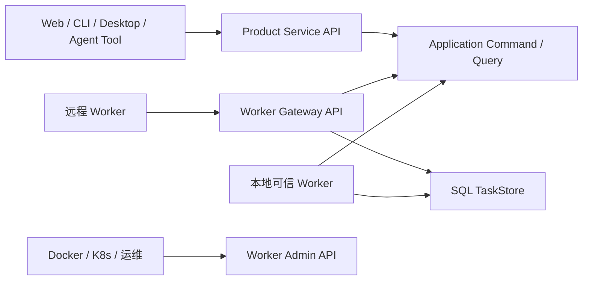

# Cosmos API 与 DTO 草案

> 状态：Draft v0.2；Product API 的已实现 catalog/当前路由、`@notnotype/nb-workflow@0.2.0` Durable Host
> 和 direct Worker Admin 以合入基线 `5ce628690ab0110b0525e8ebcbacbe673ced9c55` 的源码/测试为准；本文件仍不是
> 稳定公共合同，Gateway/Planned/Reserved 能力继续保持草案或未来边界
>
> 日期：2026-08-16
>
> 总体架构：[`../architecture/0001-cosmos-foundation.md`](../architecture/0001-cosmos-foundation.md)
>
> 信息模型：[`../architecture/0002-information-model.md`](../architecture/0002-information-model.md)
>
> 稳定边界：[`../adr/0003-service-worker-api-boundaries.md`](../adr/0003-service-worker-api-boundaries.md)
>
> 已实现规格入口：[`../spec/README.md`](../spec/README.md)
>
> Task 07 实施与未验证边界：[`.agents/tasks/07-deferred-workflow-host/README.md`](../../.agents/tasks/07-deferred-workflow-host/README.md)

## 1. 文档职责

本目录单独保存 Cosmos 的 API、Transport 和 DTO 草案。它用于：

- 从原始需求和产品模型反推完整应用能力，而不是只描述当前 Phase 1 路由；
- 固定 Product Service API、Worker Admin API 和 Worker Gateway API 的边界；
- 为后续 Zod schema、NestJS Controller、HTTP Client、Worker Client 和
  conformance tests 提供输入；
- 显式区分已实现、收敛阶段、后续阶段和仅预留的能力；
- 在不暴露 Prisma、SQLite、Data Root、Secret 或进程内对象的前提下，让 Web、
  CLI、Desktop、插件和远程 Worker 使用同一语义合同。

本目录不是 OpenAPI 生成物，也不是当前代码行为的过度声明。Draft 字段和路径不是当前公共合同；
当前实现的 Product 路由、manifest catalog 和 Worker Admin direct surface 以合入源码/测试及
[`../spec/README.md`](../spec/README.md) 标识，未接入宿主或没有行为证据的内容仍保持 Draft。

## 2. 三个 API 面



| API 面 | 主要消费者 | 责任 | 明确不负责 |
| --- | --- | --- | --- |
| Product Service API | Web、CLI、Desktop、知识管理者工具、受控扩展 | 产品 Command、Query、Run 控制、SSE、受控文件读取 | Job claim、lease token、可执行插件加载 |
| Worker Admin API | 容器探针、编排器、运维工具 | Worker 存活、就绪、状态、能力、指标、drain | 同步执行 Job、任意 Connector 调用、领域写入 |
| Worker Gateway API | 无数据库权限的远程 Worker | Session、长轮询 claim、Attempt heartbeat、Receipt、结果提交 | 第二套 Job 状态、永久 Secret、任意领域表写入 |

Product Service 与 Worker Gateway 初期可以由同一个 NestJS 进程承载，但使用独立
模块、路径和协议版本。Worker Admin 由每个 Worker 进程在独立内部端口提供。

## 3. 文件索引

- [`0001-common-contracts.md`](0001-common-contracts.md)：协议版本、Header、分页、
  错误、幂等、并发控制、ValueRef、SSE 和兼容规则。
- [`0002-product-service-api.md`](0002-product-service-api.md)：面向产品客户端的
  完整资源和端点草案。
- [`0003-product-dtos.md`](0003-product-dtos.md)：Product Service 使用的 Command、
  Query、Snapshot 和 Event DTO 草案。
- [`0004-worker-admin-api.md`](0004-worker-admin-api.md)：Worker 运维面和 drain 合同。
- [`0005-worker-gateway-api.md`](0005-worker-gateway-api.md)：远程 Worker Session、
  claim、lease、Receipt、结果和断线恢复合同。
- [`0006-scenarios-and-conformance.md`](0006-scenarios-and-conformance.md)：需求场景、
  失败场景和后续行为测试矩阵。
- [`0007-review-findings.md`](0007-review-findings.md)：多代理审查发现、处理结果和
  未决问题。

## 4. 成熟度标记

| 标记 | 含义 |
| --- | --- |
| `Current` | 当前合入基线已有等价生产路由或合同；当前 Product API catalog、Run projection、SSE 和 Worker Admin direct surface 均以源码/测试为准，路径或 DTO 仍可能在 v1 收敛前迁移 |
| `Convergence` | 本地 Durable Host、manifest-only 控制面或 Worker Admin 的后续收敛合同；只有已列明并由源码/测试覆盖的切片才是当前实现 |
| `Planned` | 原始需求或 PRD 已要求，但当前尚未实现；具体产品 Phase 另行标注 |
| `Reserved` | 为避免封死架构而保留的能力位，产品行为尚未确认 |

`Planned` 和 `Reserved` 不代表当前数据库存在同名表，也不代表当前 Web 可以使用。
当一个 `Planned` 端点属于尚未完成的 Phase 1 产品合同，表格会明确写成
`Planned · Phase 1 remainder`；这不会自动把它扩大进 Task 06。

当前阶段关系是：

| 产品范围 | 当前状态 |
| --- | --- |
| Phase 1 最小服务器闭环 | 已实现并有 focused/Node 证据；完整 browser/e2e 和真实来源仍未验证 |
| Phase 1 完整产品范围 | 尚缺 Source 删除、最小定时采集计划、Source health/checkpoint 诊断、完整 Run/Step 产品面、真实 RSS/Docker/长时间恢复等 |
| `nb-workflow` 前置门禁 | `@notnotype/nb-workflow@0.2.0` 已发布并接入当前固定 Ingest Durable Host；更广泛 Kernel/Backend conformance 仍按组件规格和后续任务演进 |
| Phase 1C / Cosmos 本地 convergence | 固定 Ingest Durable Host、manifest-only Product API catalog 和 direct Worker Admin 已有实现切片；完整 parity、跨进程 recovery、独立 Migrator、Gateway/Redis/多主机仍未实现或未验证 |
| Worker Admin | direct mode 的独立 loopback host、探针、status、capabilities、metrics 和 drain 已实现；Gateway mode、远程认证和 SIGTERM/活跃 Attempt deadline 仍未完成或验证 |
| Worker Gateway | Draft v0.2 已审查；远程执行和 fake conformance 后置，不进入当前本地 Worker 能力 |
| Phase 2–5 | 按 PRD 保持 `Planned`，不由本草案提前宣称实现 |

## 5. 从需求反推的能力面

| 需求领域 | 必需 API 资源 | 主要阶段 |
| --- | --- | --- |
| 服务器、客户端和分离部署 | health、readiness、capabilities、protocol、SSE | Current / Convergence |
| Source 与多平台采集 | SourceDefinition、SourceOperation、Connection、Source、CollectionPlan、TriggerBinding、Probe | Current / Planned |
| Workflow 主动行为核心 | Definition、Run、Activity、Step projection、Job、Attempt、Signal、Receipt、Event | Convergence |
| 不可变事实与离线信息库 | Observation、Entry、Revision、Asset、Blob | Current / Planned |
| Phase 1 最小 Story projection | 单 Entry Story、Story Detail、Story-based Feed | Current |
| 完整 Story、Topic 和关系 | StoryRevision、Membership、merge/split、Topic、Entity、Relation、Proposal | Planned |
| Knowledge 与 Research | KnowledgeSignal、ResearchRequest、Research Workflow correlation | Planned |
| 推荐与用户行为 | Feed、Related、Impression、Feedback、ReadState、SpotlightPlacement | Planned |
| 长期体验与 Agent 产物 | Workspace、InputBinding、WorkspaceUpdate、Artifact、InteractionState | Planned |
| 看板 | Board、Section、Block、rendered snapshot | Planned |
| 摘要与外部投递 | Publication、DeliveryIntent、DeliveryAttempt、Receipt、Subscription | Planned |
| 数据所有权与运维 | storage usage、backup、export、deletion plan、cleanup、integrity | Planned |
| 插件扩展 | PluginManifest、catalog、schema、capability、execution placement | Convergence / Planned |
| 远程执行 | Worker Session、Claim、Attempt、ValueRef、SecretLeaseRef、drain | Convergence design / implementation later |

## 6. 当前代码与目标差异

当前 NestJS 已提供 Source、Probe、Ingest Run、Feed、Search、Story、Entry、Revision、Asset、
manifest catalog 和 SSE。当前 Product API 已有 `api/v1` catalog 路由，catalog/probe 只读取
manifest、schema、capability 和 hash；当前 Worker 默认启动 `@notnotype/nb-workflow@0.2.0`
Durable Host，并由独立 loopback Worker Admin host 暴露运维端点。以下仍是目标差异或未验证边界：

1. NestJS Controller 仍直接依赖 Application 提供的 Prisma-backed ports；进一步的 Service/
   Application port 分层和认证仍待后续收敛。
2. `RunSnapshot`、Job/Attempt 和通用 Workflow 产品 projection 仍在收敛；当前固定 Ingest
   Run 已有 Durable Host envelope，并将内部 `waiting` 映射为公开 `running`、`completed`
   映射为公开 `succeeded`。
3. Worker Gateway、Connection、CollectionPlan、Knowledge、Research、Workspace、Publication
   等仍未实现；Gateway/remote Worker、Redis、多主机和独立 Migrator 保持未来边界。
4. HTTP Client 尚未覆盖全部当前路由，也没有通用 Command/Query Transport。
5. 当前 Product API 无认证；默认绑定 `127.0.0.1`，Compose 可显式绑定 `0.0.0.0` 并发布 API
   端口，因此只能视为本机/受信网络验收入口，不是公网部署模板。
6. fixture Source 的路径和远程暴露安全收紧仍是后续 gate；必须保持受控 fixture root，拒绝
   绝对路径、遍历和 symlink escape。
7. 当前公开 Source/Run/Job/Asset/Workflow projection 已按白名单过滤 lease token、Secret、
   storage key、绝对路径和任意内部 payload；后续 Controller 演进不能退回直接返回 Repository
   对象。
8. API 已有独立 `/healthz`、`/readyz`，Worker Admin 已有独立 `/healthz`、`/readyz`、status、
   capabilities、metrics 和 drain；Compose healthcheck 仍使用产品 `/api/v1/health`，独立
   Worker Admin 容器探针尚未在 Docker 中验证。

实现规格和源码/测试锚点见 [`../spec/README.md`](../spec/README.md) 及其
[`interfaces/0002-product-api-http.md`](../spec/interfaces/0002-product-api-http.md)、
[`application/0004-manifest-catalog.md`](../spec/application/0004-manifest-catalog.md)、
[`application/0007-workflow-host-contract.md`](../spec/application/0007-workflow-host-contract.md)、
[`runtime/0003-worker-admin.md`](../spec/runtime/0003-worker-admin.md)。

## 7. 实施顺序与门禁

本目录保存后续实现输入和已实现接口的导航，不拥有 Workflow Kernel，也不是完整当前路由清单。
`docs/spec/` 才是合入实现行为的重建合同；本 Draft 保留 Product/Gateway/Worker Admin 的
设计边界和 conformance 场景，任何字段或路径只有在源码、测试和宿主接线均存在时才标记
`Current`。

当前本地 direct 顺序已完成固定 Ingest Durable Host、manifest-only Product API catalog 和
Worker Admin；后续顺序仍为补齐 parity/恢复与独立 Migrator，再考虑远程 Worker Gateway：

```text
固定 Ingest Durable Host / manifest catalog / direct Worker Admin
-> 完整 parity、跨进程 recovery、独立 Migrator 与运维验证
-> 最后考虑远程 Worker Gateway
```

Gateway DTO 和失败场景继续保留，用于防止本地 Host/Worker 设计封死远程边界，但不得作为
当前能力或下一轮交付承诺。

Draft v0.2 尚未成为完整 `@cosmos/contracts` API schema 或完整 Gateway Server；已进入
源码/测试的 Product catalog、固定 Ingest Run projection 和 direct Worker Admin 仅按
`docs/spec/` 对应组件规格解释。实现如 conformance 暴露矛盾，先记录失败场景和证据，再修订 Draft。

## 8. 已确认的设计决定

1. 远程 Worker v1 使用 HTTPS request/response + long-poll claim，不以 WebSocket
   连接状态持有 durable truth。
2. ActionDefinition 声明 `executionPlacement`：
   `host`、`trusted_worker` 或 `remote_worker`。
3. SQL TaskStore 是 Job/Attempt/lease 的唯一权威；Gateway 和 WakeupBus 都不拥有
   第二份终态。
4. 本地可信 Worker 可以直接访问 Cosmos Backend；无数据库权限的远程 Worker
   必须经过 Gateway。
5. Worker Admin API 不提供同步 Job 执行端点。
6. 领域写入 Action 是 `host`；远程 Worker 返回经过 schema 校验的结果或
   ValueRef，再由 Cosmos Host 执行 Application Command。
7. 外部副作用按 at-least-once、幂等键、Receipt 和 reconcile 建模，不宣称
   exactly-once。
8. Gateway Attempt ownership 绑定 Session 和 owner epoch；resume 使用 TaskStore
   CAS 原子转移，旧 owner 立即失效。
9. lease 丢失后的外部结果只能通过受限 late-evidence capability 追加
   `unknown` 证据，不能续租、完成 Job 或写领域状态。
10. 未认证 Product API 只允许本机或明确受信网络；公网、远程 Product API 和真实
    Gateway 都有独立认证/HTTPS 发布 gate。

## 9. 草案更新规则

- 改动语义前先补充失败场景或 conformance case。
- 字段重命名需要更新 DTO、端点、场景和 requirement mapping。
- 已发布协议不静默改变字段含义；不兼容变化提升路径或 payload version。
- 实现阶段可以删减没有消费者的 Reserved 资源，不为“完整”制造空壳代码。
- 实现与草案不一致时，记录证据和理由，再决定修改实现还是修订草案。
- `docs/api/0007-review-findings.md` 记录草案审查和 disposition；已经归类为
  implementation gate 的问题不能靠继续增加 DTO 字段假装解决。

## 10. 非目标

- 本轮不生成 OpenAPI 文件，不实现 NestJS Controller 或 Worker Server。
- 本轮不实现认证、多租户、权限审批或第三方插件沙箱。
- 本轮不实现 PostgreSQL、Redis、S3、远程 Worker 或 Harness Adapter。
- 本轮不把未来所有资源提前写入 Prisma。
- 本轮不承诺所有 Planned 端点在同一个 Phase 交付。
