# Cosmos 总体架构设计

> 状态：Draft v0.9
>
> 最后更新：2026-08-07
>
> 原始需求真相源：[`../requirements/0001-original-requirements.md`](../requirements/0001-original-requirements.md)
>
> 产品需求：[`../requirements/0002-product-requirements.md`](../requirements/0002-product-requirements.md)
>
> 初始调研：[`../research/2026-08-06-daily-digest-research.md`](../research/2026-08-06-daily-digest-research.md)
>
> 信息领域模型：[`0002-information-model.md`](0002-information-model.md)

本文是可持续调整的总体设计，不是不可修改的最终合同。用户的新需求先逐字追加到 requirements，再在本文中解释、建模和调整；稳定且改回成本高的决定再提炼为 ADR。

## 1. 结论

Cosmos 应采用“本地优先的模块化单体 + 持久化事件/任务流水线 + 可插拔扩展 SDK”：

- Source、Trigger、Flow、Action 分开建模，提供类似 GitHub Actions 的可编排体验。
- 所有渠道先进入不可变的采集层，再形成可查询的信息库；网页 URL 只是可选来源属性。
- 信息库不只保存文章，而是保存来源记录、修订、媒体、实体、长期关注对象、具体事件、标签、批注和关联。
- Story 是每个 Entry 的上层规范内容单元，通过稳定核心 kind 和受管理、可扩展 subtype 区分形态；Topic 表示围绕问题或目标的长期、主观关注范围。
- Agent 作为 Flow 中的一种受控 Action，可以查询信息库、继续调研并生成版本化 Artifact。
- Workspace 表示长期、可更新、可交互的体验容器；Artifact 表示一次版本化输出。
- 看板是查询与编排层，不拥有底层内容。热点、精华、普通信息流和 Workspace 可以引用同一批领域对象。
- 第一阶段以看板闭环为主，推送暂缓实现，但保留可靠投递所需的 Publication、Outbox 和 Delivery 边界。

```mermaid
flowchart LR
    subgraph External["外部渠道"]
        RSS["RSS / RSSHub"]
        Social["BiliBili / X / Telegram / 群聊"]
        Mail["邮箱"]
        Web["官网 / 公告 / 搜索结果"]
        API["状态与结构化 API"]
    end

    subgraph Automation["自动化运行时"]
        Trigger["Trigger"]
        Flow["Flow"]
        Action["Action / Agent Action"]
        Runtime["Durable Run Runtime"]
    end

    subgraph Library["本地信息库"]
        Observation["Observation"]
        Entry["Entry + Revision"]
        Asset["Blob / Asset"]
        Knowledge["Story / Topic / Entity"]
        Search["全文 / 实体 / 关系检索"]
    end

    subgraph Curation["理解与策展"]
        Recommend["候选与推荐"]
        Artifact["Artifact"]
        Workspace["Workspace"]
    end

    subgraph Experience["用户体验"]
        Board["可配置 Board"]
        Publication["摘要 / Publication"]
        Delivery["后续推送"]
    end

    External --> Trigger
    Trigger --> Flow
    Flow --> Action
    Action --> Runtime
    Runtime --> Observation
    Observation --> Entry
    Observation --> Asset
    Entry --> Knowledge
    Entry --> Search
    Knowledge --> Search
    Search --> Recommend
    Search --> Artifact
    Artifact --> Workspace
    Knowledge --> Workspace
    Recommend --> Board
    Workspace --> Board
    Board --> Publication
    Publication --> Delivery
```



## 2. 目标与边界

### 2.1 产品目标

1. 在用户授权和资源预算内，尽可能广地采集用户关注领域的信息。
2. 让已采集的正文、元数据和尽可能多的图片/附件在本地离线可访问。
3. 把多个平台中的碎片信息组织成可检索、可关联、可持续更新的信息库。
4. 把“录入什么”与“现在展示什么”分开，支持广采集、窄展示。
5. 允许用户和系统通过自定义 Trigger、Flow、Action、Agent、查询和看板区块扩展行为。
6. 让所有摘要、聚类、推荐和 Agent 报告都能追溯到原始来源。
7. 先完成高自定义看板，再实现紧急推送和定时摘要。
8. 以个人本地优先作为 v1 和默认产品合同，保留未来协作所需的 actor/revision 扩展位。

### 2.2 当前非目标

- 第一阶段不解决互联网级规模、多租户 SaaS、多人账户同步或复杂协作权限。
- 第一阶段不引入 Kafka、RabbitMQ 或微服务部署。
- 不承诺所有平台都能完整下载图片、视频或受保护正文。
- 不让 LLM 直接成为原始事实、权限或外部副作用的最终裁决者。
- 不把第三方平台推荐结果视为客观质量；系统需要记录其发现来源并建立自己的展示排序。
- 第一版不建设细粒度权限 UI 或不可信插件沙箱。

## 3. 架构原则

### 3.1 原始证据与派生理解分离

外部采集到的 Observation 是证据，保持不可变。正文清洗、摘要、分类、embedding、Story 归并、推荐分数和 Agent 观点都是派生结果，可以升级算法后重算，但不能覆盖原始证据。

### 3.2 录入与展示分离

`Admission` 决定一条信息是否值得进入本地信息库；`Ranking` 决定它是否值得在当前用户、当前看板和当前时刻展示。两者使用不同的规则、预算和反馈。

### 3.3 本地优先

只要内容已经成功录入，核心文本、元数据、关系、用户批注和已保存媒体应在没有外网时仍可查询。外部链接用于回到来源，不作为本地可用性的前提。

### 3.4 扩展走合同，不走数据库

Connector、Trigger、Action、Agent 和 Board Block 只能通过版本化 SDK、Command、Query 和 Event 合同访问系统。扩展不能直接依赖数据库表名或写内部表。

第一版只运行用户明确安装的本地可信扩展，不实现细粒度权限系统；保持 SDK 和进程边界，是为了以后可以增加能力限制或更强隔离，而不是第一阶段交付权限平台。

### 3.5 持久运行

轮询、抓取、LLM、Agent 和生成任务都可能跨进程重启。每个 Run、Step、Job 和外部副作用都需要持久状态、幂等键、租约、重试预算和可诊断错误。

### 3.6 展示角色不污染领域模型

“热点”“精华”“信息流”首先是看板上的展示角色，不是所有内容必须继承的底层类型。同一个 Story 可以同时出现在热点区、某份竞品报告的依据和普通信息流中。

## 4. Source、Trigger、Flow 与 Action

用户体验可以类似 GitHub Actions，但底层需要拆开四个概念。

| 概念 | 责任 | 示例 |
| --- | --- | --- |
| `SourceDefinition` | 描述一种来源类型及其配置 schema | RSS、IMAP、Telegram、BiliBili 首页推荐 |
| `SourceInstance` | 用户配置好的一个具体来源 | 用户 A 的 BiliBili 首页、某个邮箱收件箱 |
| `Trigger` | 判断何时启动一个 Flow | 手动、cron、轮询发现变化、webhook、内部事件 |
| `FlowDefinition` | 编排一组有顺序和分支的步骤 | 拉取 → 标准化 → 去重 → 入库 → 触发分析 |
| `ActionDefinition` | 可复用执行能力 | `rss.poll`、`http.fetch`、`agent.run`、`artifact.publish` |
| `Run` / `StepRun` | 一次 Flow 和步骤的持久执行记录 | 2026-08-06 08:00 的日报 Run |

### 4.1 Trigger 类型

第一版合同预留以下 Trigger：

- `manual`：用户点击、CLI 或 API 触发。
- `schedule`：cron 或固定间隔。
- `poll`：按计划执行轻量检查，仅在游标、版本或条件变化时发出事件。
- `webhook`：外部平台主动通知。
- `event`：订阅 Cosmos 内部领域事件，例如 `entry.created`、`story.materially_updated`。
- `condition`：基于查询结果、状态或阈值触发，例如“DeepSeek 状态由 available 变为 degraded”。
- `dependency`：另一个 Flow 或 Step 成功、失败或产出特定结果后触发。

“轮询邮箱，有新邮件则触发”应建模为：

1. `schedule` 唤醒 IMAP Poll Trigger；
2. Trigger 使用持久 checkpoint 检查 UID / ModSeq；
3. 有变化时发出 `source.change_detected`；
4. Flow 调用 IMAP Action 获取并录入新邮件。

Trigger 只负责发现“应该开始”，不承担完整抓取、LLM 和写库逻辑。这样同一套 IMAP Action 可以被手动触发、定时触发或其它 Flow 调用。

### 4.2 Action 类型

- `connector`：调用外部平台或读取本地输入。
- `transform`：解析、清洗、规范化、切分和格式转换。
- `library`：通过公开 Command 写入 Entry、Asset、关系或 Annotation。
- `query`：查询信息库、Saved View 或关联图。
- `control`：条件、分支、循环、fan-out、fan-in、wait 和 retry。
- `script`：执行用户提供的受控代码。
- `agent`：启动带模型、工具、预算和配置能力范围的 Agent Run。
- `artifact`：创建或更新 Artifact Revision。
- `render`：把 Board、Workspace 或 Artifact 渲染成网页、图片或其它格式。
- `delivery`：后续向 Telegram、QQ、Email 等渠道发送。

### 4.3 Flow 定义

Flow 使用版本化声明描述触发器、输入、步骤、能力范围和预算。YAML/JSON 适合配置；复杂逻辑通过实现 Action 扩展，而不是在声明中无限增加表达式语言。

```yaml
id: important-mail-intake
version: 1

triggers:
    - kind: schedule
      every: 2m
    - kind: manual

permissions:
    - source:mail.personal.read
    - library:entry.write
    - agent:classify.run

steps:
    - id: poll
      uses: connector.imap.poll@1
      with:
          source: mail.personal

    - id: ingest
      foreach: ${{ steps.poll.items }}
      uses: library.entry.ingest@1

    - id: classify
      if: ${{ steps.ingest.created }}
      uses: agent.run@1
      with:
          profile: mail-importance
          input: ${{ steps.ingest.entryId }}
```

上例只表达合同方向，具体 DSL 在实现 Task 中通过 schema 和行为测试确定。

### 4.4 自定义代码与插件

扩展包使用 manifest 声明：

- 唯一 ID、版本和兼容的 Cosmos SDK 版本；
- 提供的 Source、Trigger、Action 或 Board Block；
- 配置 schema 与 Secret 引用；
- 网络、文件、模型、库查询、库写入和外部投递能力声明；
- 幂等、超时、取消和恢复能力；
- 运行入口和资源预算。

执行策略分两级：

1. 内置、受信任扩展可以在受控 Worker 中运行。
2. 用户或第三方代码默认在独立进程中运行，只通过 RPC SDK 访问能力。

第一版只实现用户明确安装的本地可信扩展，不建设细粒度权限 UI 或不可信代码沙箱。公开合同仍不得依赖进程内对象或直接数据库访问，以免后续无法隔离。

### 4.5 Agent 是 Action，不是特殊旁路

`agent.run` 与其它 Action 使用相同的 Run、配置能力范围、超时、取消、日志、产出和重试合同。Agent 可以：

- 查询 Entry、Story、Topic、Annotation 和 Saved View；
- 调用被授权的外部搜索/抓取 Action；
- 创建 Annotation、关系建议和 Artifact Revision；
- 请求用户确认；
- 发出后续 Flow Event。

在用户已经配置的内部范围内，Agent 可以创建或维护 Topic、Workspace 和 Artifact。创建新的外部 Source、扩大数据范围或执行 Telegram/Email 等外部发送，必须经过用户显式配置或批准；这是一条产品边界，不要求第一版先建设复杂权限系统。

Agent 不能：

- 改写 Observation；
- 绕过 Connector 或 Library Command 直接写表；
- 未经授权扩大来源、读取 Secret 或发送外部消息；
- 把自己的结论伪装成来源原文。

## 5. 持久化事件与任务运行时

Cosmos 的生产者/消费者特征集中在运行时，而不是把整个产品简化成一个 FIFO 队列。

### 5.1 三类持久记录

| 类型 | 用途 |
| --- | --- |
| `DomainEvent` | 已发生的领域事实，例如 `entry.created` |
| `Job` | 等待某个 Worker 执行的工作 |
| `OutboxIntent` | 准备调用外部系统的副作用 |

Command 在一个数据库事务中修改领域状态并写入 Event/Outbox。Dispatcher 在提交后投递任务，避免“数据库已写但事件丢失”。

### 5.2 Job 状态

```text
queued
  -> leased
  -> succeeded

leased
  -> retry_wait
  -> queued

leased
  -> failed_terminal
  -> cancelled
```

需要等待用户、外部 webhook 或 Agent 后续输入的 Step 使用 `waiting`，不占用 Worker lease。

### 5.3 幂等、租约与接管

- 每个 Job 和外部 Intent 有业务幂等键。
- Worker 领取任务时取得 `lease_token` 和 `lease_expires_at`。
- 心跳只能延长当前 token 的 lease。
- lease 过期后新 Worker 可以接管；旧 Worker 不能用旧 token 提交成功。
- 超时和取消必须先收口受 Cosmos 所有的子进程，再释放 lease。
- 重试使用有上限的指数退避，终态失败进入可查询的失败队列。

内部执行采用 at-least-once，因此 Action 必须幂等。外部系统不提供幂等键或查询接口时，无法承诺 exactly-once。

### 5.4 外部结果未知

发送请求后进程可能在保存响应前中断。此时记录：

```text
uncertain
```

`uncertain` 不自动当作失败重发。恢复策略由渠道能力决定：

- 能按 idempotency key 查询：查询后收敛为 sent/failed。
- 不能查询但重复可接受：策略可明确允许重发。
- 重复不可接受：等待用户或受控恢复。

### 5.5 Lane、限流与预算

任务至少区分：

- `urgent`
- `interactive`
- `ingestion`
- `analysis`
- `artifact`
- `maintenance`

限流可以绑定 Connector、SourceInstance、域名、账号、模型和用户预算。大量推荐信息录入不能饿死用户交互和紧急状态检查。

## 6. 采集层：Observation 没有 URL 假设

### 6.1 Observation

Observation 表示 Cosmos 在一次采集过程中看到的不可变外部事实：

```text
Observation
├─ id
├─ sourceInstanceId
├─ sourceEventId?          外部稳定 ID，可空
├─ eventKind               create / update / delete / snapshot
├─ occurredAt?             来源时间
├─ capturedAt              Cosmos 获取时间
├─ originLocator           结构化来源定位
├─ discoveryContext        为什么会发现它
├─ payloadRef              原始 payload 或 Blob 引用
├─ contentFingerprint?
├─ webUrl?                 可选网页链接
└─ runId                   哪次 Flow 产生
```

`RawObservation.url` 不作为必需字段。`webUrl` 只在来源提供稳定网页入口时存在。

Telegram 消息的 `originLocator` 可以是：

```json
{
    "provider": "telegram",
    "kind": "message",
    "accountId": "personal",
    "conversationId": "-100123456",
    "messageId": "4821",
    "authorId": "9988"
}
```

公众号、群聊和邮件使用各自字段。系统同时生成稳定的内部地址，例如：

```text
cosmos://entry/01J...
```

内部地址用于看板、Artifact 引用和离线跳转，不假装它是外部网页 URL。

### 6.2 Discovery Context

同一条内容为什么被发现，会影响后续推荐与审计。每次采集记录：

- `followed_account`
- `home_recommendation`
- `search_query`
- `announcement_watch`
- `mailbox`
- `direct_message`
- `manual_import`
- `related_link`
- `agent_research`

搜索词、推荐页面位置、关注列表或父 Entry 作为结构化参数保存。这样系统能区分“用户明确关注”与“平台首页偶然推荐”。

### 6.3 Entry 与 Revision

Observation 是每次看到的事实，Entry 是一个外部信息单元在 Cosmos 中的稳定身份：

```text
Connector Run
  -> Observation(create)
  -> Entry
  -> EntryRevision(1)

Later poll
  -> Observation(update)
  -> EntryRevision(2)
```

例如 Telegram 消息被编辑时，旧 Observation 和 Revision 保留，新版本追加。来源删除时追加 delete Observation，并在 Entry 上投影当前可见状态；本地是否保留已采集内容由用户保留策略决定。

跨平台的两篇报道仍是两个 Entry。它们可以被标记为副本、转载或加入同一个 Story，但不丢失各自来源身份。

### 6.4 Asset 与“尽可能保存”

图片、音频、视频、PDF、HTML 快照和其它附件统一建模为 Asset：

```text
Asset
├─ id
├─ sha256?
├─ mediaType
├─ byteLength?
├─ sourceLocator
├─ localBlobRef?
├─ acquisitionStatus
├─ failureReason?
├─ rightsPolicy?
└─ observedAt
```

`acquisitionStatus` 至少包含：

- `pending`
- `stored`
- `metadata_only`
- `skipped_policy`
- `too_large`
- `authentication_required`
- `failed_retryable`
- `failed_terminal`
- `source_unavailable`

Blob 使用内容寻址去重。原始媒体与缩略图、转码和 OCR 结果分开：原始媒体属于可备份数据，派生变体属于可重建缓存。

“尽可能保存”由每个 SourceInstance 的媒体策略控制，包括：

- 允许的媒体类型；
- 单文件和单次 Run 的字节预算；
- 是否抓取外链图片；
- 是否保存视频本体或只保存封面与元数据；
- 认证内容和隐私内容的保留期限；
- 失败重试次数。

## 7. 信息库领域模型

本节只保留总体架构摘要。Entry、Story、Topic、相关性、推荐和 Workspace 的判定规则以 [`0002-information-model.md`](0002-information-model.md) 为准。

### 7.1 建议术语

| 用户当前称呼 | 建议领域对象 | 说明 |
| --- | --- | --- |
| 原始信息 | `Observation` + `Entry` | 前者保留采集证据，后者是可查询的信息单元 |
| 上层规范内容 | `Story` | 每个 Entry 的主上层单元；event kind 严格聚合同一现实事件 |
| 话题 | `Topic` | 围绕问题或目标持续组织 Story，不直接收录 Entry |
| 精华 | `Workspace` + 可选 `Artifact` | Workspace 是长期体验；Artifact 是报告、网页和附件包 |
| 热点 | `Spotlight` | 一段时间内的高关注展示决定，可引用 Story、Topic、Workspace 或 Artifact |
| 信息流 | `Feed` / `SavedView` | 由查询、候选生成和排序产生 |
| 看板 | `Board` | 用户可配置的 Section 与 Block 集合 |

这些是架构内部的建议名称，中文 UI 文案可以在产品设计阶段继续调整。

### 7.2 Story：统一规范内容单元

event Story 聚合报道同一现实事件的多个 Entry，例如：

```text
Story: 阿里发布 Qwen-Image-3.0-Pro
├─ 官方公告
├─ X 发布帖
├─ BiliBili 评测
├─ 媒体报道
└─ 本地部署教程（document Story，related，但不是同一 event Story member）
```

Story 保存：

- 当前标题和状态；
- 首次与最近更新时间；
- 成员 Entry 及其关系；
- 结构化时间线；
- 当前摘要和关键事实；
- 实体、地点和产品；
- 新颖性、重要性、紧急性；
- 归并算法版本、置信度和人工修正；
- 最近一次 Workspace / Publication 状态。

每个 Entry 默认拥有一个主 Story，允许单 Entry Story。Story 核心 kind 包括 event、document、media 和 thread，细分使用受管理的 subtype 注册表；注册项声明所属 kind、版本、展示信息和身份规则。内置与插件 subtype 使用同一合同，未知 subtype 可按核心 kind 降级展示。event 候选生成结合时间、实体、来源、标题和地理，严格判定需要比较人物/组织、动作、对象、时间、地点和关键事实。不确定时先分开，后续允许 merge/split。

Story membership 按 kind 表达规范内容身份。共享人物、主题或语义相似的不同 Story 使用 Relationship 或共同 Topic 关联。

Story merge 选择 canonical ID，并保留旧 ID alias、revision 和引用。Story split 则保留旧 Story 为历史壳，以 `replaced_by[]` 指向全部后继 Story；当前成员转移保存显式 mapping，旧 ID 不会被静默重定向到某一个后继。

Story 身份保持稳定；当前标题、摘要、关键事实和时间范围通过不可变 Story Revision 表达，并由 `current_revision_id` 选择当前表示。只有语义实质变化才产生新 Revision，每个 Revision 保存 producer、evidence、confidence 和变更摘要；历史 Artifact 和 Publication 固定引用原 Revision。

merge 后当前收藏、隐藏、不感兴趣和反馈解析到 canonical Story，同时保留旧对象历史来源；split 后这些状态以及 Topic membership 留在历史壳，不自动复制给全部后继，必须通过显式 migration command 选择继承对象。

人类接受的字段可以被保护。Agent 更新先生成候选 Revision；未受保护字段可以按策略自动提升，受保护字段不能被静默覆盖。第一版不做复杂三方合并，候选至少支持整体接受/拒绝，并保留字段级 producer、actor 和依据。

### 7.3 Topic：长期、目的驱动的关注范围

Topic 表示用户或 Agent 为持续理解一个问题而建立的范围，不要求成员属于同一事件：

- DeepSeek API 状态；
- 如何看待 DeepSeek 涨价及其后续影响；
- 为什么 Jeff Dean 离职引起轰动；
- 某个大会的议题与进展；
- AI 写作类项目；
- Claude 原理学习计划；
- 某个公司、人物、技术或产品系列。

Topic 可以绑定：

- 搜索查询；
- SourceInstance；
- 关注实体和标签；
- Story；
- 定时 Flow；
- 告警规则；
- Saved View；
- Workspace。

Story 可以属于多个 Topic。Topic 不替代 Story，例如“DeepSeek 定价与生态影响”是 Topic，“DeepSeek 2026-08-06 宣布涨价”是 Story。Topic 只收录 Story，成员应记录 `core`、`update`、`background`、`analysis`、`counterpoint` 或 `tutorial` 等角色。

v1 不建立 Topic 父子层级；Topic 之间的联系使用带类型的 Relation、标签或 Workspace/Board 组织。一个 `(Topic, Story)` 只有一个当前成员角色，纳入、移除和角色变化通过 revision history 保留操作者、理由、证据和关联 Run。

Agent 可以直接移除系统/Agent 自动加入且未被人类确认的成员；人类明确加入或确认的成员只能由 Agent 提议移除。所有移除形成可恢复的 membership revision，不静默删除历史。

### 7.4 Entity 与 Relationship

Entity 保存人物、组织、产品、项目、地点、模型和其它可识别对象。Relationship 是有来源的有向关系：

```text
Entry --mentions--> Entity
Story --about--> Entity
Story --related_to--> Story
Entry --explains--> Story
Artifact --derived_from--> Entry
Workspace --tracks--> Topic
```

每个自动关系保存 producer、version、confidence 和 evidence；用户确认或手工创建的关系单独标记，重新分析不能覆盖。

### 7.5 Label、Annotation、Collection 与 Saved View

- `Label`：用户或系统定义的分类标签。模型建议与用户确认分开。
- `Annotation`：对 Entry、Story、Topic、Artifact 或具体文本片段的批注、观点和待办。
- `Collection`：用户手工维护的有序集合。
- `SavedView`：持久化查询，例如“过去 48 小时、开发类、未读、来自关注账号”。

“便签”按 Annotation 理解；如果后续需求指的是标签，应在下一轮原始需求中明确，两者架构上都已保留。

## 8. 检索与查询

用户原文中的 “BM5” 当前按 “BM25” 理解。SQLite FTS5 提供 BM25 排序能力，适合第一阶段本地全文检索。

### 8.1 四类检索信号

1. 结构化过滤：时间、来源、作者、媒体类型、标签、状态、读写状态和 Topic。
2. 词法检索：FTS5 + BM25，适合精确术语、名称和代码。
3. 关系检索：Story、Topic、Entity、引用、转载和 Artifact provenance。
4. 未来语义检索：embedding，适合概念相似与跨语言查询；第一版不实现。

第一版查询先做结构化剪枝，再组合 BM25、Entity、时间、引用和关系候选，最后用可解释排序合并。embedding 作为未来可替换 Projection，不写死在领域对象中。

### 8.2 Query Contract

查询合同应能表达：

```text
text
semanticText
timeRange
sourceIds
discoveryKinds
labels
subjectIds
storyIds
entityIds
mediaTypes
readState
savedState
relatedTo
sort
limit
cursor
```

Board、Agent、搜索页和推荐系统消费同一 Query 服务，不各自直接拼 SQL。

### 8.3 索引是 Projection

FTS、推荐特征和关系邻接索引属于可重建 Projection；未来 embedding 也遵循同一合同：

- 每个索引记录 schema/producer version。
- 变更算法时创建重建任务，不阻塞原始采集。
- 重建期间保留旧索引服务，准备完成后原子切换。
- 核心 Entry、用户 Annotation 和来源链不依赖索引才能恢复。

## 9. 采集相关性与推荐系统

### 9.1 两道决策

```text
外部候选
  -> Admission：是否值得保存
  -> 本地信息库
  -> Ranking：是否值得此刻展示
```

Admission 倾向于高召回，但必须受存储、网络、隐私和来源预算约束。Ranking 倾向于高精度，结合当前 Board、时间、用户反馈和内容新颖性。

### 9.2 候选来源

- 用户明确关注的账号、Feed、邮箱和网站。
- 平台主页推荐。
- 用户或系统为 Topic 配置的搜索查询。
- 已录入 Entry 中的相关链接、作者和引用。
- Agent 深入调研发现的来源。
- Story/Entity 关联扩展。

### 9.3 非 LLM 默认信息流

普通信息流默认不需要 LLM 逐条参与。候选与排序可以使用：

- 来源/作者权重；
- 用户明确关注；
- 新鲜度与去重；
- Topic/Label 匹配；
- 阅读、收藏、隐藏、停留和后续点击反馈；
- 内容质量与媒体完整度；
- 探索配额，防止推荐越来越窄；
- 已在 Spotlight/Workspace 展示的降权。

LLM 可离线提供主题、实体、质量特征或小规模 rerank，但 Feed 在模型不可用时仍应工作。

### 9.4 Impression 与 Feedback

系统记录一条内容是否被展示，而不只记录是否被点击：

- `impression`
- `open`
- `save`
- `hide`
- `not_interested`
- `follow_topic`
- `annotate`
- `complete_interaction`

Feed 的主要展示对象是 Story，因此 impression、open、read、hide 和 not_interested 默认绑定 `(用户, Story, surface)`；展开具体信源后再补充 Entry 级交互。收藏和批注可以明确指向 Story 或 Entry。

反馈属于用户真相；训练或排序使用时保留 policy/version，避免一次算法升级改变历史含义。

Read State 额外保存用户在 Story/surface 上最后看过的 `last_seen_revision_id`。当当前 Revision 变化时显示“有更新”，但不把历史已读记录重置为未读。

### 9.5 Spotlight Policy

Spotlight 分别保存趋势、重要性、紧急性和用户兴趣信号，由版本化 policy 计算进入与续期。自动 Placement 使用可续期 TTL 和迟滞阈值，进入门槛高于保持门槛，避免在临界分数附近反复闪烁。

每次 Placement 保存信号明细、主要原因、policy/version、`expires_at`、actor 和 Run。人工固定或排除在解除前覆盖自动策略，LLM 只能贡献信号，不能单独决定 Spotlight。

## 10. Agent、Artifact 与 Workspace

### 10.1 Artifact：可追溯的工作产物

Artifact 是人或 Agent 生成的版本化内容包，可以包含：

- Markdown、HTML、JSON 和数据文件；
- 图片、图表和附件；
- 可视化页面；
- 批注和分析报告；
- 交互页面的静态代码与资源；
- provenance manifest。

建议物理形态：

```text
artifacts/
└─ <artifact-id>/
   └─ revisions/
      └─ <revision-id>/
         ├─ artifact.json
         ├─ provenance.json
         ├─ index.html
         ├─ data/
         └─ assets/
```

`artifact.json` 至少声明：

- kind、title、entrypoint 和 media type；
- producer、Flow Run、Agent Run 和模型；
- 依赖的 Entry/Story/Topic/Artifact 及精确 revision；
- 生成时间和刷新策略；
- 交互能力与所需宿主能力；
- 内容 hash 和文件清单。

Artifact Revision 提交后不可原地修改。刷新产生新 Revision，旧版本可追溯。

### 10.2 Workspace：长期、可更新的体验容器

Workspace 是一个长期存在、可更新、可交互的用户体验单元。它替代此前边界过宽且容易与“软件功能”混淆的 `Feature`。它可以引用：

- 一个或多个 Story；
- 一个或多个 Topic；
- 一个或多个 Artifact；
- Saved View、Collection 或 Query；
- 刷新 Flow；
- 用户 Interaction State。

这些输入通过多对多 `WorkspaceInputBinding` 表达，并可设置一个可选主要锚点用于标题、导航和默认上下文。主要锚点不表示所有权；Learning Workspace 等对象可以没有 Topic。

内部名称已确认为 `Workspace`；UI 按 kind 使用“栏目”“专题”“学习计划”或“工作区”。Workspace 的 Saved View、Collection 和 Query 结果以 Story 为内容单位，不直接持有 Entry。

示例：

| 使用场景 | 建模 |
| --- | --- |
| SeedRealtime 发布热点 | Story → Spotlight；需要深读时创建 Dossier Workspace |
| 每天记五个单词 | Learning Workspace → 每日 Artifact Revision + 用户完成状态 |
| 深入了解 Claude 原理 part 5 | Learning Workspace → Topic + 课程 Artifact + 进度 |
| 每日 AI 写作竞品分析 | Brief Workspace → Topic + 每日研究 Artifact |

Workspace 与 Artifact 分开，避免每次 Agent 刷新报告时丢失栏目配置、用户进度和看板位置。Timeline、Dossier、Brief、Learning 和 Custom 是 Workspace View，不是新的聚合实体。

### 10.3 交互状态

Artifact 文件与用户交互状态分开保存：

- Artifact Revision 是可重现的内容。
- `WorkspaceInteractionState` 保存完成、回答、批注、进度和偏好。
- 刷新 Artifact 时按 manifest 的 migration contract 迁移或保留交互状态。

例如“每天五个单词”的打卡和答案不会因为 Agent 重新生成页面而消失。

### 10.4 Workspace 更新状态

Workspace 的生命周期、维护执行、内容新鲜度、Board 可见性和 Interaction State 分开建模。“Agent 正在更新”由持久 `WorkspaceUpdate`/Run 及其投影表达，不写成一个混合所有含义的 Workspace `status`。

用户至少应看到 `queued`、`running`、`waiting`、`failed` 等更新状态，以及关联 Agent/Flow Run、操作者、当前步骤、开始时间、预算和最近完成结果。Workspace Update 完成状态还包括 `succeeded` 和 `cancelled`；更新期间继续展示最近一次成功发布的内容，新 Artifact 先暂存并在成功后原子切换。并发更新、重复触发合并和取消/接管的细节仍待确认。

### 10.5 Agent 自主调研

Agent 可以由以下条件触发：

- 用户手动要求；
- Topic 的定时研究 Flow；
- 新 Story 达到重要性阈值；
- 信息库发现新的竞品 Entity；
- Workspace 到达刷新时间；
- 现有 Artifact 的依赖发生实质更新。

每个 Agent Run 需要：

- 明确目标和输出 schema；
- 可查询的数据范围；
- 可调用 Connector/Action；
- token、时间、网络和文件预算；
- 最大递归/子任务数；
- 是否允许创建新 Source/Trigger；
- 是否需要用户审批；
- 完整 provenance。

Agent 的观点应以 Annotation 或 Artifact 保存，并引用依据；不能改写 Entry 正文。

### 10.6 可视化页面安全

Agent 生成的 HTML/JS 默认在沙箱 iframe 中显示：

- 严格 CSP；
- 无宿主 DOM、文件系统、Secret 和数据库直接访问；
- 只通过受限 Bridge 读取 manifest 允许的数据或写入 Interaction State；
- 网络访问默认关闭；
- 生成文件经过大小、类型和入口校验。

## 11. 看板架构

### 11.1 Board、Section 与 Block

```text
Board
└─ Section[]
   └─ Block[]
```

Board 保存用户布局和主题；Section 表示热点、精华、信息流等区域；Block 是可配置渲染单元。

首批 Block 类型：

- `spotlight`：展示一个或多个高关注 Workspace / Story / Topic / Artifact。
- `workspace`：展示精选、学习、报告或交互体验。
- `feed`：展示 Saved View 或推荐结果。
- `story-timeline`：展示 Story 时间线和多来源观点。
- `topic-status`：展示长期 Topic 的状态、指标和最近变化。
- `artifact`：嵌入报告、图表或可视化页面。
- `query-result`：展示用户配置的固定查询。
- `collection`：展示手工集合。

### 11.2 Block 数据来源

Block 可以绑定：

- 固定对象 ID；
- Workspace；
- Saved View；
- 动态 Query；
- Recommendation Policy；
- Flow 输出；
- 插件提供的数据和 Renderer。

布局配置不复制内容。删除一个 Block 不删除 Story、Entry、Artifact 或用户批注。

### 11.3 默认看板

第一版默认看板可以按用户描述组织：

1. 热点：Spotlight Block 展示 Story、Topic、Workspace 或 Artifact。
2. 精华：展示 Agent 或用户策展的 Workspace、Artifact 或 Story。
3. 信息流：按娱乐、硬件、开发等 Saved View 或推荐策略分区。

用户可以重新排序、隐藏、复制和配置区块；未来允许多个 Board，例如“工作”“AI 研究”“娱乐”和“晨间摘要”。

### 11.4 深入页面

点击热点后进入 Story / Topic 深入页或对应 Workspace：

- 多来源成员和观点差异；
- 时间线；
- 官方来源与二手来源；
- 相关教程、项目和 Entity；
- Agent 批注与 Artifact；
- 相关 Feed；
- 用户 Annotation、收藏和追踪操作。

“本地部署 Qwen-Image-3.0-Pro 教程”使用独立 document Story，并与发布 event Story 建立 related 关系，不能强行成为同一 event Story 成员。

## 12. Publication 与后续推送

推送暂不作为第一阶段实现重点，但需要从一开始保留以下模型：

### 12.1 Publication

Publication 是某个时点冻结的用户可见版本，例如 08:00 晨报：

- 固定 Board 或 Query snapshot；
- 使用的 Story、Topic、Workspace、Entry 和 Artifact revision；
- 标题、摘要和渲染模板；
- HTML 页面；
- 渲染图片；
- 可公开或鉴权访问的内部链接；
- policy 和生成 Run。

先冻结候选 snapshot，再生成文字和图片，避免生成过程中信息库变化导致页面、图片和推送内容互相不一致。

### 12.2 Delivery

```text
Publication
  -> DeliveryIntent
  -> Channel Adapter
  -> DeliveryAttempt
```

Channel Adapter 负责把平台无关的优先级、图片、正文和链接映射到 Telegram、QQ、Email 等渠道。

推送主要服务：

- 紧急状态变化；
- 用户追踪 Topic 的重大 Story 更新；
- 定时摘要；
- 用户明确订阅的 Workspace 更新。

热点判定、重要性、紧急性和最终渠道优先级分开保存。LLM 可以提供建议，但硬规则和用户策略拥有最终路由权。

## 13. 数据所有权与存储

### 13.1 数据类别

| 类别 | 示例 | 删除/重建语义 |
| --- | --- | --- |
| 原始证据 | Observation、原始 payload、已保存原图 | 按保留策略删除，不能由重分析替代 |
| 核心身份 | Entry、SourceInstance、Story 人工修正 | 持久真相 |
| 用户真相 | Label、Annotation、Collection、Board、交互进度 | 持久真相，升级必须迁移 |
| 派生理解 | 摘要、实体建议、embedding、Story 自动归并 | 可重建，但保留版本和当前选择 |
| Artifact | 报告、网页、附件包 | 版本化产物；未被引用的旧版本按策略清理 |
| 缓存 | 缩略图、转码、临时候选、查询 cache | 可删除、可重建、有容量预算 |
| 外部副作用账本 | DeliveryIntent、Attempt、receipt | 审计真相，不从日志推断 |

### 13.2 第一阶段存储

- SQLite + WAL：核心元数据、关系、用户状态、Run、Job 和 Outbox。
- FTS5：本地词法全文索引和 BM25 排序。
- 可替换的 Vector Index：第一阶段可使用 SQLite 扩展，合同不绑定具体实现。
- Content-addressed Blob Store：原始 payload、图片、附件和大文本。
- Artifact Root：版本化 Artifact 文件夹。
- Cache Root：缩略图、转码、临时抓取和重建索引。
- Secret Store：与普通配置分离；具体使用 OS 凭据库还是加密文件待实现 Task 决定。

建议运行时目录：

```text
<Cosmos Data Root>/
├─ cosmos.sqlite
├─ blobs/
│  └─ sha256/
├─ artifacts/
├─ cache/
├─ logs/
└─ secrets/
```

源码 checkout 不是用户数据根。测试必须使用独立的临时 Data Root。

### 13.3 未来迁移

模块化 SQL Repository 和公开 Query/Command 合同允许未来将核心数据库迁移到 Postgres。Blob 可以迁移到 S3 兼容对象存储，Worker 可以拆成多进程或多主机；领域模型和扩展 SDK 不应因此改变。

第一阶段不为未来分布式部署引入双写或复杂一致性协议。

## 14. 模块与仓库布局

采用一个仓库、一个版本体系和清晰模块边界。逻辑上存在 Web、API 和 Worker 入口，第一阶段可以由一个开发命令共同启动。

```text
cosmos/
├─ apps/
│  ├─ web/                    Vue/Nuxt 看板
│  ├─ server/                 HTTP API、Command、Query
│  └─ worker/                 Scheduler、Flow、Job Worker
├─ packages/
│  ├─ contracts/              DTO、事件和版本化公共 schema
│  ├─ domain/                 Entry、Story、Topic、Workspace 等领域逻辑
│  ├─ application/            Use case、Command、Query、事务边界
│  ├─ automation-runtime/     Trigger、Flow、Run、Job
│  ├─ connector-runtime/      Source 与 Connector 宿主
│  ├─ library/                录入、关系、Annotation、Collection
│  ├─ search/                 FTS、vector、hybrid query
│  ├─ recommendation/         Admission、candidate、ranking、feedback
│  ├─ artifacts/              Artifact 与 Renderer
│  ├─ storage-sqlite/         SQLite、迁移、Blob metadata
│  └─ sdk/                    第三方扩展 SDK
├─ plugins/
│  └─ builtin/                首批 Connector、Action、Block
├─ docs/
├─ migrations/
└─ fixtures/
```

不要仅为了目录完整就提前创建空 package。实现每条垂直切片时创建实际需要的模块，并用依赖规则保持方向：

```text
apps/plugins -> application/contracts/sdk
application -> domain/contracts
storage/runtime -> application ports
domain -> no infrastructure dependency
```

## 15. 公开合同

### 15.1 Command

所有状态修改通过 Command，例如：

- `IngestObservation`
- `UpsertEntryRevision`
- `AttachAsset`
- `AssignStoryMember`
- `CreateAnnotation`
- `CreateArtifactRevision`
- `UpdateBoard`
- `RecordInteraction`

Command 负责范围检查、校验、事务、幂等和 Event/Outbox。

### 15.2 Query

所有读取通过 Query Service：

- `SearchLibrary`
- `GetEntry`
- `GetStoryWorkspace`
- `GetTopicWorkspace`
- `ResolveSavedView`
- `RankFeed`
- `RenderBoard`
- `GetArtifactManifest`

插件和 Agent 获取的是经过授权的 DTO，不是 ORM 对象。

### 15.3 Event

事件名称和 payload version 显式管理：

```text
source.change_detected.v1
observation.captured.v1
entry.created.v1
entry.revised.v1
story.materially_updated.v1
subject.signal_changed.v1
artifact.published.v1
workspace.refreshed.v1
publication.ready.v1
```

消费者记录 Event ID 和处理幂等键。事件升级增加新版本，不静默改变旧 payload 含义。

## 16. 安全、隐私和平台边界

- Source Secret 与普通配置分开，日志只记录 Secret 引用。
- 私信、群聊和邮件默认是敏感信息；Agent、插件和 Artifact 的读取范围按 Source/Conversation/Label 控制。
- 生成 Artifact 时默认不复制完整敏感原文，除非模板和权限明确允许。
- 每个 Connector 需要记录认证方式、平台限制、速率限制和允许的采集范围。
- BiliBili、X、公众号和群聊的真实接入方式、平台条款与登录态风险必须逐个调研，不能由通用 Connector 合同代替验收。
- 用户删除 Source 凭据不自动删除已采集数据；删除来源、撤销权限和删除历史是三个明确动作。
- 外部网页和 Agent 生成页面均视为不可信内容，渲染和解析需要隔离。

## 17. 使用场景映射

### 17.1 08:00 晨报

```text
schedule trigger
  -> snapshot morning Board
  -> select Story / Topic / Workspace / Feed
  -> agent or template summary
  -> render HTML + image
  -> create Publication
  -> DeliveryIntent for QQ / Telegram / Email
```

Publication 中保存精确 snapshot，用户点击链接进入对应 Board 版本或当前 Board，并能继续打开 Story、Entry 和 Artifact。

### 17.2 产品发布热点

```text
官方公告 + X + BiliBili + 新闻
  -> Entry[]
  -> Story
  -> Topic association
  -> Spotlight decision
  -> Story / Topic detail or Dossier Workspace
```

深入页展示不同信源和时间线；相关教程通过关系和推荐出现，不需要伪装成同一报道。

### 17.3 每天五个单词

```text
Learning Workspace
  -> daily schedule
  -> query learning Topic and progress
  -> agent creates Artifact Revision
  -> Board interactive Block
  -> Interaction State records answers/completion
```

### 17.4 每日竞品分析

```text
Competitor Topic
  -> search/followed Sources
  -> new Entries and Stories
  -> scheduled agent.run
  -> versioned research Artifact
  -> Workspace refresh
```

### 17.5 普通分类信息流

```text
Saved View / recommendation policy
  -> candidate generation
  -> dedupe and ranking
  -> Feed Block
  -> impression and feedback
```

默认路径不要求 LLM 在线参与。

## 18. 实施路线

### Phase 0：架构基础

当前阶段。

- 原始需求、架构、Task 和 ADR 工作流。
- 核心术语、所有权、扩展边界和恢复语义。

完成标准：后续需求能明确落到已有对象，或通过记录变更理由调整对象。

### Phase 1：信息录入与离线查询垂直切片

- Source/Trigger/Flow/Action 最小合同。
- manual + schedule Trigger。
- RSS/RSSHub 真实 Connector 和一个 fixture Connector，先验证通用合同，再扩展到其它平台。
- Observation、EntryRevision 和 Asset。
- SQLite、Blob Store、FTS5/BM25。
- 最小搜索页和普通 Feed Board Block。

完成标准：定时录入真实信息，重启后不重复，断网后仍可搜索正文和已保存图片。

### Phase 2：信息组织与可配置看板

- Label、Annotation、Collection、Saved View。
- Board/Section/Block 配置。
- Story、Topic 和基础关系。
- 多分区 Feed 与 Spotlight。

完成标准：用户能按来源、分类、时间、全文和 Topic 浏览，并能打开一个多来源 Story。

### Phase 3：Agent Artifact 与 Workspace

- `agent.run` Action。
- Artifact Workspace、Revision、provenance 和沙箱渲染。
- Recurring Workspace 和 Interaction State。
- 技术博客批注、竞品分析和学习 Workspace。

完成标准：Agent 能从信息库生成可追溯报告/页面，刷新后保留用户进度。

### Phase 4：推荐与广度扩展

- Admission Policy、候选生成、Ranking、Impression/Feedback。
- 平台推荐页、关注账号、搜索查询和相关链接来源。
- BM25、Entity、时间、引用和关系混合检索；第一版不使用 embedding。
- 存储、网络和探索预算。

完成标准：普通信息流不依赖在线 LLM，能解释主要排序信号并避免明显重复。

### Phase 5：Publication 与推送

- Board snapshot、HTML/图片渲染。
- Telegram、Email、QQ 等 Channel Adapter。
- Outbox、receipt、uncertain 和恢复。
- 紧急 Topic/Story 路由。

完成标准：08:00 摘要和紧急更新可追溯、可恢复，不因 Worker 重启盲目重复发送。

## 19. 当前决定

以下决定进入 v0.9 基线，但后续需求仍可通过记录理由调整：

1. Source、Trigger、Flow、Action 分离。
2. URL 为可选字段；结构化 origin locator 承担来源定位。
3. Observation 不可变，Entry 通过 Revision 表达来源变化。
4. Story 与 Topic 分开；Story 是带 kind 的规范内容单元，Topic 表示目的驱动的长期范围。
5. Artifact 与 Workspace 分开；Workspace 保存长期体验，Artifact 保存版本化产物。
6. Timeline 是视图；热点是 Spotlight 展示决定；精华是 Board 策展角色。
7. 看板与底层内容解耦，Block 通过 ID、Workspace、Saved View 或 Query 引用内容。
8. Agent 使用普通 Action/Run 合同和配置能力范围。
9. 第一阶段采用本地 SQLite + Blob/Artifact 文件存储。
10. 看板优先，推送后置，但保留 Publication/Delivery 边界。
11. 每个 Entry 默认拥有一个主 Story，允许单 Entry Story；Topic、Workspace、Spotlight 和 Feed 等上层体验使用 Story，不直接使用 Entry。
12. Topic 只收录 Story；Agent 自动创建 Topic 后默认启用独立 Maintenance Binding。
13. 第一版聚类和相关推荐不使用 embedding。
14. Agent 自动创建 Topic 需要至少两个不同 Story，或命中用户明确跟踪规则。
15. Topic 不自动过期，人工归档后置。
16. 人类、Agent 和系统按协作者记录 actor、revision、理由与关联 Run。
17. 第一版预算使用全局日预算、单次 Run 上限和紧急保留预算，超预算时降级为确定性规则。
18. `active`、Board 可见性、Spotlight 和订阅拆成独立 Binding/Placement/Subscription。
19. 自动 Spotlight 使用可续期 TTL，人工固定可以不设 TTL。
20. 第一版保留 actor/revision/理由/Run 审计，复杂权限与冲突处理后置。
21. 一个 Entry 只有一个主 Story，但可以作为证据关联多个其它 Story。
22. Story/Topic merge 使用 canonical ID，并保留旧 alias/redirect、历史 revision 和引用。
23. Story subtype 通过受管理注册表扩展；注册项声明核心 kind、版本、展示信息和身份规则，核心 kind 合同保持稳定。
24. Story split 保留旧 Story 历史壳，并以 `replaced_by[]` 指向全部后继；旧 ID 不模糊重定向到单一后继。
25. v1 不建立 Topic 父子层级；Topic Relation、标签和 Workspace/Board 负责跨 Topic 组织。
26. 一个 `(Topic, Story)` 只有一个当前成员角色，历史变化保存在 membership revision history。
27. Story 当前标题、摘要、关键事实和时间范围使用不可变 Story Revision，并由 `current_revision_id` 选择当前表示。
28. Feed 的 impression/open/read/hide/not interested 默认按 `(用户, Story, surface)` 记录，Entry 交互在展开信源后补充。
29. Agent 只能直接移除未被人类确认的自动 Topic 成员；人类确认成员需要提出移除建议。
30. Workspace 输入使用多对多 binding 和可选主要锚点，不要求一个 Workspace 只绑定一个 Topic。
31. Spotlight 使用分离信号、版本化 policy、迟滞阈值、可续期 TTL 和人工覆盖。
32. Workspace 更新运行态与生命周期、内容新鲜度、Board 可见性和 Interaction State 分开。
33. Workspace Update 使用 `queued`、`running`、`waiting`、`succeeded`、`failed` 和 `cancelled`；失败/取消保留上一成功版本，成功时原子发布。
34. 人类接受的 Story/Workspace 字段可以保护；Agent 先生成候选 Revision，不能静默覆盖受保护字段。
35. Story Read State 保存 `last_seen_revision_id`，新 Revision 只派生“有更新”，不删除已读历史。
36. merge 将当前用户状态解析到 canonical；split 不自动将用户状态和 Topic membership 扇出到全部后继。
37. Spotlight 人工固定/排除绑定具体 target placement，直到用户解除；不同 kind 共用 policy 合同。
38. v1 和默认产品合同面向单个本地用户；未来协作不破坏 actor/revision 合同，但当前不建设多人同步和多租户。
39. Agent 可在用户配置范围内自主维护内部对象；创建外部 Source、扩大数据范围或外部发送需要显式配置/批准。
40. 第一版不建设细粒度权限 UI 或不可信插件沙箱，只运行用户明确安装的本地可信扩展。
41. Phase 1 首条真实 Connector 使用 RSS/RSSHub，并配套 fixture Connector。

## 20. 核心边界结论与后置决定

本次 grilling 已结束。首批来源和扩展信任范围已经确认；其它问题保留为后置决定，不阻塞 Phase 0。

### 20.1 首批来源

已确认：Phase 1 先实现 RSS/RSSHub + 本地 fixture。该切片用于验证定时采集、修订、媒体、去重、无 URL 内容和离线查询；BiliBili/X 等平台接入后置。

### 20.2 插件信任范围

已确认：第一版不建设权限平台或不可信插件沙箱，只运行用户明确安装的本地可信扩展。扩展仍使用 SDK/Command/Query/Event，不直接写核心数据库，以保留未来隔离升级空间。

### 20.3 本地数据保留

【决策点】Cosmos 默认保存多少原始媒体和历史修订？

【背景】“尽可能保存”与磁盘、隐私和版权存在直接冲突。文本、图片、视频和私信需要不同策略。

【选项】

- 推荐：文本与元数据长期保存；图片按预算保存；视频默认只保存元数据、封面和用户明确收藏的本体。
- 最大化保存所有可获取媒体，离线能力最强但成本和风险最高。
- 只保存文本与外链，空间最小但不满足稳定离线浏览。

【建议】采用第一项，并允许每个 SourceInstance 覆盖。

【选错代价】策略可调整，但未下载且来源后来消失的内容无法补回；过度保存则需要可靠清理和隐私工具。

## 21. 架构不变量

后续实现和重构必须持续验证：

1. 新算法不能改写原始 Observation。
2. 外部信息没有 URL 时仍能完整录入、查询、关联和显示。
3. 重新抓取和重启不能无界地产生重复 Entry、Job 或推送。
4. 用户标签、批注、收藏、Board 和交互进度不因重分析或 Artifact 刷新丢失。
5. 每个自动摘要、关系、Story 归并和 Artifact 都能追溯 producer/version/evidence。
6. Connector、Action、Agent 和 Board 插件不直接依赖核心数据库表。
7. Feed 在 LLM 不可用时仍能工作。
8. 已保存内容在断网时仍能被搜索和阅读；未保存媒体清楚显示状态。
9. 删除看板区块不会删除其引用的信息。
10. 外部副作用结果未知时不会被伪装为成功或自动当作失败重放。
11. Story split 不会让旧链接或历史 Artifact 被静默导向错误的单一后继。
12. v1 的 Topic 关系不会被实现成隐含的父子树。
13. 同一 Topic 中同一 Story 的当前角色唯一，历史修改可审计。
14. Story 当前表示更新不会改写历史 Artifact、Publication 或批注引用的 Revision。
15. Feed 反馈的粒度与实际被排序、展示的 Story 保持一致。
16. Agent 不会静默移除人类明确加入或确认的 Topic 成员。
17. Workspace 的输入 binding、主要锚点和身份相互独立。
18. Spotlight 人工覆盖在解除前不会被自动策略反向修改。
19. Workspace 更新失败不会把上一次成功内容替换为半成品。
20. 人类接受的字段保护不会被 Agent 自动更新绕过。
21. Story 的“有更新”投影不会伪造或删除历史已读记录。
22. split 不会把收藏、隐藏、反馈或 Topic membership 无提示地复制到所有后继。
23. Spotlight 人工覆盖在具体 Placement 上生效，不会意外改变其它 Board 的展示。
24. 第一版不会因为未来多人协作设想而引入多租户、同步或复杂权限系统。
25. Agent 不会在没有用户显式配置/批准时增加外部来源、扩大数据范围或发送消息。
26. 本地可信扩展仍不能直接依赖核心数据库表，未来隔离升级不需要重写扩展合同。

## 22. 变更记录

### v0.9 - 2026-08-07

- v1 和默认产品合同确认为个人本地优先，未来协作仅保留 actor/revision 扩展位。
- Agent 可维护已配置范围内的内部对象；新外部来源、扩大数据范围和外部发送需要显式配置/批准。
- 第一版不建设细粒度权限 UI 或不可信插件沙箱，只运行本地可信扩展。
- Phase 1 首条真实 Connector 确认为 RSS/RSSHub + fixture。
- 本次 grilling 结束，未解决问题转入后置清单。

### v0.8 - 2026-08-07

- Workspace Update 正式采用六种状态，失败/取消保留上一成功内容，成功时原子发布。
- 人类接受字段优先于 Agent 候选 Revision，受保护字段不能被静默覆盖。
- Read State 使用 `last_seen_revision_id` 和 `updated_since_last_seen`。
- merge/split 用户状态迁移采用 canonical 解析与显式 migration，不自动扇出。
- Spotlight 人工覆盖绑定具体 Placement，直到用户解除；不同 kind 共用 policy 合同。

### v0.7 - 2026-08-07

- Story 当前表示采用不可变 Story Revision 和 `current_revision_id`。
- Feed 曝光与主要反馈按 Story/surface 记录。
- Agent 只能直接移除未被人类确认的自动 Topic 成员。
- Workspace 输入采用多对多 binding 和可选主要锚点。
- Spotlight 采用分离信号、版本化 policy、迟滞、TTL 和人工覆盖。
- 新增 Workspace Update/Run 状态边界，更新运行态不再与 Workspace 生命周期或看板状态混写。

### v0.6 - 2026-08-07

- subtype 正式采用受管理注册表，核心 kind 合同保持稳定。
- Story split 正式采用历史壳 + `replaced_by[]` + 显式成员转移，不做模糊单目标重定向。
- v1 不建立 Topic 父子层级，改用 Relation、标签或 Workspace/Board 组织。
- Topic membership 正式采用一个当前角色与 revision history。

### v0.5 - 2026-08-07

- 核心 Story kind 保持稳定，细分通过可扩展 subtype。
- 正式采用 TopicMaintenanceBinding、BoardPlacement、SpotlightPlacement 和 Subscription 解耦。
- 确认自动 Spotlight 使用可续期 TTL，人工固定可以不设 TTL。
- 第一版简化权限与预算：保留 actor/revision/理由/Run，使用全局日预算、单次 Run 上限和紧急保留预算。
- Entry 只有一个主 Story，可通过 evidence_for/mentions 关联其它 Story。
- Story/Topic merge 使用 canonical ID + alias/redirect，保留历史引用。

### v0.4 - 2026-08-07

- Story 扩展为带 kind 的统一规范内容单元，每个 Entry 默认拥有一个主 Story。
- Agent 自动创建 Topic 需要至少两个不同 Story，或命中用户明确跟踪规则。
- Topic 不自动过期，人工归档后置。
- 人类、Agent 和系统统一按协作者记录 actor/revision。
- 接受分层多维维护预算、召回缺口度量和 Workspace 按 kind 显示中文名称。
- 提出将维护、Board 放置、Spotlight 和订阅从 Topic 字段中拆出的候选方案。

### v0.3 - 2026-08-07

- 接受 `Subject -> Topic` 与 `Feature -> Workspace`。
- 每个事件型 Entry 默认创建或加入 Story，允许单 Entry Story。
- Topic 只收录 Story；Topic、Workspace、Spotlight 等语义聚合体验使用 Story，不直接使用 Entry，普通 Feed 的内容单位待确认。
- Agent 创建 Topic 默认激活。
- 第一版聚类和相关推荐不使用 embedding。
- Topic 与 Spotlight 的过期、合并和每日维护预算可配置，并允许 Agent 维护。

### v0.2 - 2026-08-06

- 将同一事件的 Story 聚类与宽泛相关推荐分开。
- 用 Topic 替代 Subject，强调目的驱动、可持续且主观的内容范围。
- 用 Workspace 替代 Feature，Artifact 继续表示版本化输出。
- 明确 Timeline 是视图，热点是 Spotlight 决定，精华是 Board 策展角色。
- 将详细判定规则拆分到 [`0002-information-model.md`](0002-information-model.md)。

### v0.1 - 2026-08-06

- 建立 Source / Trigger / Flow / Action 模型。
- 将 URL 调整为可选来源属性。
- 建立 Observation、EntryRevision、Asset、Story、Subject、Artifact、Feature 和 Board 模型。
- 把广采集 Admission 与看板 Ranking 分开。
- 明确 Agent Artifact、交互状态、持久运行和后续投递边界。
