## 1. 结论

Cosmos 应采用“服务器优先的本地优先模块化单体 + 持久化事件/任务流水线 + 稳定 Transport + 可插拔扩展 SDK”：

- Source、Trigger、Workflow、Action 分开建模，提供类似 GitHub Actions 的可编排体验。
- 所有渠道先进入不可变的采集层，再形成可查询的信息库；网页 URL 只是可选来源属性。
- 信息库不只保存文章，而是保存来源记录、修订、媒体、实体、长期关注对象、具体事件、标签、批注和关联。
- Story 是每个 Entry 的上层规范内容单元，通过稳定核心 kind 和受管理、可扩展 subtype 区分形态；Topic 表示围绕问题或目标的长期、主观关注范围。
- Agent 作为 Workflow 中的一种受控 Action，可以查询信息库、继续调研并生成版本化 Artifact。
- 知识管理者是共享长期记忆之上的高权限系统角色，可以通过 Web Chat、`cosmos cli` 和 ingest/research Workflow 参与系统操作。
- Workflow 是 Cosmos 的主动行为核心；Ingest、Knowledge、Research、Maintenance、Delivery 和 Interaction 共用 `nb-workflow` 的规范脚本 Kernel，不在 Cosmos 内长期维护第二套 replay 语义。
- `nb-workflow` 以类似 LangChain 的可组合组件提供脚本执行、Activity journal、并发、等待和恢复协议；持久化是显式选择的 Backend 能力，不绑定 Cosmos、Prisma、SQLite 或 Harness。
- Cosmos Workflow Host 负责持久 Run/Journal、TaskStore、Job/Attempt/Lease、Outbox、Worker 和领域事务；SQL 是任务权威，可选 WakeupBus 只负责唤醒。
- Workspace 表示长期、可更新、可交互的体验容器；Artifact 表示一次版本化输出。
- 看板是查询与编排层，不拥有底层内容。热点、精华、普通信息流和 Workspace 可以引用同一批领域对象。
- 逻辑上保持模块化单体，物理上从第一条切片起分为 Next.js Web、NestJS API 和 Worker 进程；这不是微服务拆分，而是明确的宿主边界。
- 服务器部署是第一优先级，同时为嵌入式客户端和客户端与服务分离保留同一套 Service Endpoint、Command、Query、Event 和流式 Transport 合同。
- 第一阶段以看板闭环为主，推送暂缓实现，但保留可靠投递所需的 Publication、Outbox 和 Delivery 边界。

```mermaid
flowchart LR
    subgraph External["外部渠道"]
        RSS["RSS / RSSHub"]
        Social["BiliBili / X / Telegram / 群聊"]
        Mail["邮箱"]
        Web["官网 / 公告 / 搜索结果"]
        API["状态与结构化 API"]
    end

    subgraph Automation["自动化运行时"]
        Trigger["Trigger"]
        Workflow["Workflow"]
        Kernel["nb-workflow Kernel"]
        Host["Cosmos Workflow Host"]
        Action["Action / Agent Extension"]
    end

    subgraph Library["本地信息库"]
        Observation["Observation"]
        Entry["Entry + Revision"]
        Asset["Blob / Asset"]
        Knowledge["Story / Topic / Entity"]
        Search["全文 / 实体 / 关系检索"]
    end

    subgraph Curation["理解与策展"]
        Recommend["候选与推荐"]
        Artifact["Artifact"]
        Workspace["Workspace"]
    end

    subgraph Experience["用户体验"]
        Board["可配置 Board"]
        Publication["摘要 / Publication"]
        Delivery["后续推送"]
    end

    External --> Trigger
    Trigger --> Workflow
    Workflow --> Kernel
    Kernel --> Host
    Host --> Action
    Host --> Observation
    Observation --> Entry
    Observation --> Asset
    Entry --> Knowledge
    Entry --> Search
    Knowledge --> Search
    Search --> Recommend
    Search --> Artifact
    Artifact --> Workspace
    Knowledge --> Workspace
    Recommend --> Board
    Workspace --> Board
    Board --> Publication
    Publication --> Delivery
```



## 2. 目标与边界

### 2.1 产品目标

1. 在用户授权和资源预算内，尽可能广地采集用户关注领域的信息。
2. 让已采集的正文、元数据和尽可能多的图片/附件在本地离线可访问。
3. 把多个平台中的碎片信息组织成可检索、可关联、可持续更新的信息库。
4. 把“录入什么”与“现在展示什么”分开，支持广采集、窄展示。
5. 允许用户和系统通过自定义 Trigger、Workflow、Action、Agent、查询和看板区块扩展行为。
6. 让所有摘要、聚类、推荐和 Agent 报告都能追溯到原始来源。
7. 先完成高自定义看板，再实现紧急推送和定时摘要。
8. 以个人本地优先作为 v1 和默认产品合同，保留未来协作所需的 actor/revision 扩展位。

### 2.2 当前非目标

- 第一阶段不解决互联网级规模、多租户 SaaS、多人账户同步或复杂协作权限。
- 第一阶段不引入 Kafka、RabbitMQ 或微服务治理；Web、API、Worker 的多进程宿主只用于形成清晰的运行边界。
- 不承诺所有平台都能完整下载图片、视频或受保护正文。
- 不让 LLM 直接成为原始事实、权限或外部副作用的最终裁决者。
- 不把第三方平台推荐结果视为客观质量；系统需要记录其发现来源并建立自己的展示排序。
### 2.3 当前实现与设计合同

当前实现基线为 `5ce628690ab0110b0525e8ebcbacbe673ced9c55`，依赖
`@notnotype/nb-workflow@0.2.0`。固定的 `cosmos.ingest@1` 已接入
`nb-workflow` Durable Host：Cosmos 提供 Prisma Workflow Backend、Host Store、
Value Store、Event Sink、Action Registry 和三条本地 lane（Run、Activity、Completion），
Worker 默认启用该 Host；只有显式设置
`COSMOS_WORKFLOW_HOST_ENABLED=false` 才回退到保留的 legacy IngestionWorker 路径。

API 手动触发和 schedule 通过版本化 `cosmos.ingest@1` 创建带 definition、input、
correlation 和 Source execution snapshot 的 `WorkflowRun`；Worker 依次执行
`source.fetch@1`、`library.ingest@1[]` 和 `source.checkpoint@1` Activity Job，写入
Observation、Entry/Revision、Asset、最小 Story、FTS、DomainEvent/Outbox 和 checkpoint。
Run/Job/Completion 的 lease、幂等、重试和双重 fencing 由 Host/SQL 持久边界负责；Probe
与 legacy Source Job 仍保留为兼容/回退 lane。通用自定义 Workflow 的安装、配置和稳定
管理 API 仍不是完整产品能力。

Product API 当前通过静态 Manifest Catalog 读取 Source、Workflow 和 Action 定义、schema、
capability 及 hash；Controller 的 catalog 路由和 Source probe 不加载或执行 executable，
executable 只在 Worker 执行面注册。公开投影使用白名单，不能把 lease token、Secret、
storage key、绝对路径或任意内部 payload 作为 Product DTO 返回。

Worker Admin 当前由 Worker 进程提供独立的 Node `http` loopback host，默认
`127.0.0.1:9091`，提供 `/healthz`、`/readyz`、`/metrics` 以及
`/admin/v1/status`、`/admin/v1/capabilities` 和 drain 端点；direct mode 的 poll、readiness、
manifest evidence、错误脱敏、幂等 drain 和 active poll/Attempt 分离已有 focused 测试。
非 loopback 绑定必须显式提供授权回调；Gateway/remote Worker 仍未实现。

实现行为的可重建合同见 [`docs/spec/README.md`](../spec/README.md) 及其
[`application/0007-workflow-host-contract.md`](../spec/application/0007-workflow-host-contract.md)、
[`application/0008-workflow-host-runtime.md`](../spec/application/0008-workflow-host-runtime.md)、
[`application/0004-manifest-catalog.md`](../spec/application/0004-manifest-catalog.md)、
[`interfaces/0002-product-api-http.md`](../spec/interfaces/0002-product-api-http.md) 和
[`runtime/0003-worker-admin.md`](../spec/runtime/0003-worker-admin.md)。Task 07 的 focused/full
测试和 Node durable smoke 已有证据；Docker、browser/e2e、真实来源、跨进程 recovery、
长时双 Worker fencing、Worker Admin SIGTERM/活跃 Attempt deadline、Gateway/Redis/多主机仍未验证
或未实现。

以下内容是本架构确认的设计合同，但不是当前已经交付的能力：

- TaskStore + WakeupBus 的正式公共 Port、自适应唤醒和可选 Redis Streams Adapter；当前
  SQLite TaskStore 与 fallback polling 已能支撑本地 Host，但 Redis/WakeupBus 不是当前实现；
- 通用自定义 Workflow 的插件加载、稳定管理 API、Trigger/Binding 产品模型和完整生产运维面；
- Connection、SecretStore、ConnectorStateStore、多个采集计划和 Source Operation 的完整持久模型；
- 将固定 Ingest 已验证的双 lease fencing 扩展到未来 Knowledge、Research、Artifact、Delivery
  等全部领域写入和外部副作用；
- Knowledge Workflow、KnowledgeSignal、ResearchRequest、Research Workflow、Trigger Consumer
  和循环保护；
- Outbox 的完整投递/消费恢复链路、独立 Migrator、Gateway/remote Worker、多主机和可选 Redis；
- `neuro-agent-harness`/`nb-memory` Adapter、Knowledge Manager Web/CLI 和个性化配置生成。

Round 98–105 已把固定 Ingest 从 focused seam 接到 API、schedule 和生产 Worker：
URL-free fallback 使用规范化 `sourceLocator`，discovery provenance 至少保存
manual/schedule、Workflow ref 和 Action command key；事实事务同时验证 Run/Job
lease，Prisma 接管测试证明旧 Worker 不能继续写；Source checkpoint 使用
revision/CAS，过期并发 Run 不会回滚 cursor；Workflow Run 保存 correlation、
真实 started/finished 时间，以及独立 `SourceExecutionSnapshot`。排队后修改
Source 配置不会改变已创建 Run 的 fetch 输入，相同幂等键也复用首次快照。

仍待收口的是 Connection/多采集计划 StateStore、Source 删除与历史事实保留、
Blob GC、弱 fallback identity 的强度/版本合同、journal value/reference 与
retention，以及把同样的写入 fence 扩展到后续领域 Command。

## 3. 架构原则

### 3.1 原始证据与派生理解分离

外部采集到的 Observation 是证据，保持不可变。正文清洗、摘要、分类、embedding、Story 归并、推荐分数和 Agent 观点都是派生结果，可以升级算法后重算，但不能覆盖原始证据。

### 3.2 录入与展示分离

`Admission` 决定一条信息是否值得进入本地信息库；`Ranking` 决定它是否值得在当前用户、当前看板和当前时刻展示。两者使用不同的规则、预算和反馈。

### 3.3 本地优先

只要内容已经成功录入，核心文本、元数据、关系、用户批注和已保存媒体应在没有外网时仍可查询。外部链接用于回到来源，不作为本地可用性的前提。

### 3.4 扩展走合同，不走数据库

Connector、Trigger、Action、Agent 和 Board Block 只能通过版本化 SDK、Command、Query 和 Event 合同访问系统。扩展不能直接依赖数据库表名或写内部表。

第一版只运行用户明确安装的本地可信扩展，不实现细粒度权限系统；保持 SDK 和进程边界，是为了以后可以增加能力限制或更强隔离，而不是第一阶段交付权限平台。

### 3.5 持久运行

轮询、抓取、LLM、Agent 和生成任务都可能跨进程重启。每个 Run、Activity、
Job/Attempt 和外部副作用都需要可恢复状态、幂等键、租约、重试预算和可诊断
错误；命名 Step 作为可选投影也必须可重建或持久化。

### 3.6 展示角色不污染领域模型

“热点”“精华”“信息流”首先是看板上的展示角色，不是所有内容必须继承的底层类型。同一个 Story 可以同时出现在热点区、某份竞品报告的依据和普通信息流中。

### 3.7 多宿主与 Transport 边界

Cosmos 需要兼容三种运行形态：

1. **服务器部署模式**：Next.js Web、NestJS API 和 Worker 部署在同一服务器或同一 Docker Compose 应用中，作为第一优先级交付形态。
2. **客户端模式**：Desktop Shell 承载 Web UI，并启动或连接本机 API/Worker；数据仍由本地服务管理。
3. **客户端与服务分离模式**：Desktop Shell 或浏览器连接远端 API/Worker，客户端不拥有核心数据库写入权。

宿主可分离性需要区分“进程已经分开”和“可以部署到不同物理主机”：

- Web 当前只通过 HTTP/SSE 使用 API，可以部署在独立主机。
- NestJS API 与 Worker 当前是独立进程，没有同步 RPC 调用；它们通过同一个
  SQLite/Data Root 中的 Run、Job、lease、Outbox 和领域状态协作。
- 因为 SQLite、Blob Root 和 Artifact Root 仍要求本地共享，当前 API 与核心
  Worker 可以分容器并共享卷，但不支持安全地部署到不同物理主机。
- 真正的多主机可信 Worker 目标是 PostgreSQL TaskStore/领域库、S3/MinIO
  ValueStore 和可选 Redis WakeupBus；远程或第三方 Worker 则通过 Worker Gateway
  主动连接，不直接访问数据库或 Data Root。

三种模式共享以下边界：

- UI、Connector、Agent 和外部扩展通过版本化 Service Endpoint 访问应用能力，不直接导入 Prisma Client、SQLite Repository 或 Data Root 实现。
- Command 负责状态修改，Query 负责读取，Event 负责跨模块通知；Transport 负责把这些合同映射到 HTTP、JSON 和 SSE，不把 HTTP 路由名称当作领域合同。
- 服务暴露健康检查、协议/能力版本和可操作错误。协议不兼容、服务不可用、校验失败、冲突、未找到和结果未知需要分别表达。
- SSE 事件带有稳定 Event ID 和协议版本；客户端重连时携带游标，服务无法补齐缺失事件时返回 `snapshot_required`，由客户端重新获取授权快照后继续。
- Blob 与 Artifact 通过服务端受控地址或下载能力访问；客户端不根据文件系统路径拼接用户数据地址。

控制面与执行面还必须进一步解耦：

- API 当前只加载 Workflow/Action/Adapter manifest、schema 和 capability，负责 Command、Query、Run 控制、SSE 和 catalog/probe；它不加载 Connector executable、不执行 Workflow，也不访问外部平台。实现锚点见 [`interfaces/0002-product-api-http.md`](../spec/interfaces/0002-product-api-http.md)。
- Worker 加载 Workflow 脚本、Action/Connector executable 和 Agent Extension，注册 manifest evidence，领取 Job 并执行 Activity；当前 direct Worker 的组合锚点见 [`runtime/0001-worker-process.md`](../spec/runtime/0001-worker-process.md)。
- 独立 Migrator 在 API/Worker 启动前执行数据库迁移仍是目标运维边界；当前 Compose 仍由 API 启动命令执行 migration，不能把独立 Migrator 写成已实现能力。
- Worker Admin 已由 Worker 进程的独立 loopback Node `http` host 提供；可靠任务仍通过 TaskStore 领取，不通过同步 HTTP 调用形成第二套调度真相。

当前合入代码已满足 manifest-only Product API 和 direct Worker Admin 的本地切片；API/Worker 仍共享 SQLite/Data Root，未认证 Product API 只适用于本机或明确受信网络。Compose 的公网绑定、Docker、Gateway、Redis 和多主机部署仍是后续或未验证边界。

对外 API 正式拆成三个面：

| API 面 | 消费者 | 责任 |
| --- | --- | --- |
| Product Service API | Web、CLI、Desktop、知识管理者工具 | Product Command、Query、SSE、受控文件 |
| Worker Admin API | 容器探针、编排器、运维工具 | health、readiness、status、capability、metrics、drain |
| Worker Gateway API | 无数据库权限的远程 Worker | Session、long-poll claim、Attempt heartbeat、Receipt、Result |

Product Service 与 Worker Gateway 初期可以由同一个 NestJS 宿主承载，但使用独立
模块、路径和协议版本。Worker Admin 使用独立内部端口，不提供同步 Job execute。
远程 Worker v1 使用 HTTPS long-poll；Gateway 必须先在 SQL TaskStore 原子 claim
再返回 Attempt lease，不以 HTTP 连接、Redis 消息或进程内 Session 决定 owner。
Attempt owner 由持久
`(attemptId, ownerSessionId, ownerEpoch, leaseToken, leaseExpiresAt)` 决定；
Session replacement 只停止旧 Session 新 claim，显式 resume 通过 TaskStore CAS
转移 owner、递增 epoch 并轮换 token。并发 Gateway claim 还必须原子保留
Session/lane slot，Worker 上报的 free slot 只是提示。

ActionDefinition 还必须声明 `executionPlacement`：

```text
host
trusted_worker
remote_worker
```

领域 Command/checkpoint 是 `host`；依赖 Browser Bridge、本机 profile 或其它受信任
资源的是 `trusted_worker`；只有 `remote_worker` Action 才能发给普通 Gateway
Session。远程 output 经 schema/hash 校验后由 Cosmos Host 提交，远程 Worker 不
直接写领域表、checkpoint 或 Outbox。

Desktop Shell 的具体技术（Tauri、Electron 或其它实现）、安装生命周期、远端认证和公网暴露策略都保持在宿主层，不进入领域模型。

### 3.8 Web 组件与开发工具边界

Web 展示层按四层单向依赖组织：

```text
页面数据容器
  → Cosmos 产品组件
    → components/ui primitives
      → 全局语义 token
```

- 页面数据容器负责 Product API、SSE、表单提交和页面级状态，不把 Transport 或远程数据访问下沉到展示组件；
- Cosmos 产品组件表达 Feed、Source、Search、Story 和状态摘要等可复用产品语义，使用显式 props 与合成 fixture 即可独立渲染；
- `components/ui` 继续维护 shadcn `base-nova` / Base UI primitive 源码，不为未来换肤增加只转发 props 的包装层；
- 产品组件只消费 Cosmos/shadcn 语义 token，不依赖某套主题私有变量或字面主题颜色；颜色、圆角、密度、阴影和字体优先在 token 与 primitive 层调整。
- 全局语义 token 由两轴组成：NeuroBook theme（`data-cosmos-theme="neurobook"`，承载字体栈、密度、圆角、表面角色和动效）× macOS colorway（`data-cosmos-colorway="macos-light" | "macos-night"`，承载颜色）；页面与组件继续只消费语义变量，不读取主题/配色 id 或写字面颜色（见 [`neurobook-theme-system` Proposal](../proposals/neurobook-theme-system.md)）。

组件实验室是开发工具，不是 Product Service 能力。开发模式的 `/dev/components` 使用固定、脱敏的合成 fixture 展示真实 primitive 和产品组件；它不访问 Product API、SSE、Prisma、SQLite、Blob Root、Artifact Root 或用户数据。生产构建访问该路由必须返回 404，实验室不进入产品导航。

实验室只允许调节组件 props、交互状态、已登记主题/配色和设计 token。URL 保存有界、可分享的会话选择；大量 token 草稿只保存在版本化 localStorage，并可经边界校验后原子导入/导出 JSON。浏览器不获得源码写入、任意 CSS、外部模块加载或代码执行能力。

所有 `components/ui` 公共模块和无副作用的 Cosmos 产品组件都必须登记至少一个默认实验室场景；Route、Layout、Provider、数据请求容器、测试 helper 和一次性内部实现不在该登记合同内。注册表与公共组件模块的一致性由 CI 行为测试强制，不能只依赖评审记忆。具体方案与验收见已接受的 [`react-component-lab` Proposal](../proposals/react-component-lab.md)。

