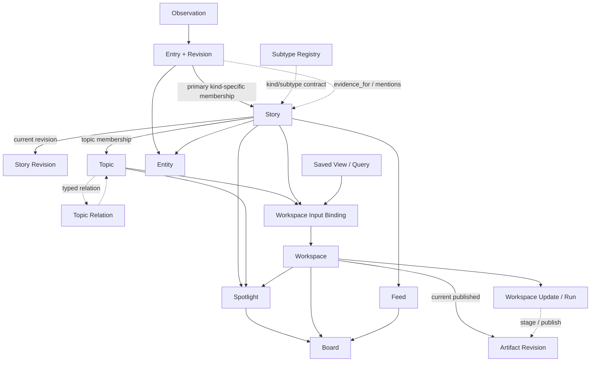

## 5. Topic：主观、长期、目的驱动的组织

### 5.1 Topic 不等于大号 Story

Story 按 kind 维护规范内容身份；Topic 的成员条件是“对这个问题有帮助”。因此 Topic 可以跨事件、文档和媒体，但成员只允许 Story。Entry 只能作为 Story 内的来源证据，不直接成为 Topic 成员。

```text
Topic: 为什么 Jeff Dean 离职引起轰动？
├─ Story: Jeff Dean 离开 Google
├─ Story: Jeff Dean 等人创立 Discovery Loop
├─ Story: Jeff Dean 加入 Google
└─ Story: Gemini 团队相关组织变化
```

### 5.2 Topic 的最小语义

Topic 应保存：

- 标题或核心问题；
- 关注目的；
- 范围说明与排除项；
- seed Story / Entity；
- 创建者和创建理由；
- 成员关系及成员角色；
- revision 和协作历史。

`active`、Board 可见性、Spotlight 和订阅不成为 Topic 字段，正式拆分为：

```text
Topic
TopicMaintenanceBinding
BoardPlacement
SpotlightPlacement
Subscription
```

其中 Topic 只保存自身语义；维护、展示和通知由外部关系表达。该拆分正式采用。

v1 不建立 Topic 的 `parent_id`、`children` 或其它结构性父子层级。Topic 之间若有重叠、关联或上下文关系，使用带类型的 `TopicRelation`、标签，或交给 Workspace/Board 组织；这样不会把导航树误当成 Topic 语义本身。

推荐的成员角色：

- `core`：直接回答核心问题；
- `update`：新的进展；
- `background`：背景材料；
- `analysis`：分析或观点；
- `counterpoint`：反方或不同证据；
- `tutorial`：实践、教程或延伸行动。

一个 `(Topic, Story)` 组合只有一个当前角色。纳入、移除或角色变更会生成新的 membership revision，并记录 actor、理由、evidence 和关联 Run；历史角色仍可追溯，但 v1 不把人类、多个 Agent 的建议保存为同一关系上的并列 assertion。角色比简单的“包含/不包含”更适合构建完整专题页面。

Agent 的移除权限按成员来源区分，但不引入完整的对象级权限系统：

- 系统或 Agent 自动纳入、且尚未被人类确认的成员，Agent 可以直接移除；
- 人类明确加入或确认的成员，Agent 只能提交移除建议，不能静默移除；
- 任意移除都写入 membership revision/tombstone，可恢复，并保留 actor、理由、evidence 和 Run。

### 5.3 Agent 自动创建 Topic

Agent 自动创建 Topic 的默认门槛是：

- 至少两个不同 Story 共同构成持续问题；或
- 命中用户明确配置的长期跟踪规则。

用户仍可基于任意 Story 手动创建 Topic。单个紧急 Story 通常进入 Spotlight，而不是自动创建 Topic。补充判断可以综合：

- Story 数量和增长速度；
- 独立来源数量；
- 是否跨越多个事件；
- 用户关注强度；
- 重要性与持续更新可能；
- 现有 Topic 是否已覆盖；
- 维护成本。

Topic 不自动过期。人工归档能力后置且当前优先级较低。

所谓“默认激活”表示创建 Topic 后自动建立 `enabled=true` 的 TopicMaintenanceBinding，而不是在 Topic 上写 `active`。

第一版只实现全局每日 Agent 预算、单次 Run 的 token/时间/工具调用上限和紧急保留预算。复杂的对象级继承、公平调度和预算借用后置。成员增删和 Topic merge 都保留 actor、revision、理由和审计记录。

### 5.4 人类与 Agent 协作

人类、Agent 和系统都作为 actor。每次修改至少记录：

- actor kind 与 actor ID；
- operation 与目标对象；
- base revision 与结果 revision；
- 时间、理由和可选 evidence；
- 对应 Run / Workflow / Agent profile；
- 可逆操作或补偿记录。

第一版保持本地单用户和简单能力边界：保留 actor/revision/理由/Run 记录，细粒度权限、并发冲突 UI、ChangeRequest 和复杂撤销后置。

**v1 切片（[`topic-domain-v1` Proposal](../../proposals/topic-domain-v1.md)，2026-09-08 accepted）**：Topic 域模型 v1 落地 §5.2/§5.3 的人工作业部分——Topic 自身 title/purpose/scope 走不可变 `TopicRevision`（确定性 fingerprint、无实质变化 no-op、当前指针）；`(Topic, Story)` 单一当前角色 + 不可变 membership revision，移除为可恢复 tombstone；成员角色使用 §5.2 六个受管枚举、未知值降级读取；Topic merge 复用 §4.6 的 canonical/alias Canonicalization 并迁移成员；Agent 自动创建与维护（§5.3）、`TopicMaintenanceBinding`、`TopicRelation`/父子层级、归档与 Spotlight/Board/Subscription 后置。Story merge 在 Topic 存在后同步迁移指向 obsolete Story 的 membership 到 canonical（§4.6 merge 侧语义）。

## 6. 推荐系统入门：Cosmos 如何找到“相关内容”

### 6.1 推荐不是一个算法

一个实用推荐系统通常包含四步：

1. **候选生成（recall）**：从大量 Story 中快速找到几十或几百个可能相关的候选。
2. **特征计算**：计算候选与当前上下文之间的不同相关信号。
3. **排序（ranking）**：根据当前页面目标和用户偏好给候选打分。
4. **重排（reranking）**：去重、限制同源/同 Story 挤占，并加入多样性和探索。

不同页面的目标不同，必须使用不同 Ranking Policy：

- Story 详情页：优先背景、后续和教程；
- Topic 页：优先覆盖完整性、观点差异和新进展；
- 普通 Feed：优先个人兴趣、新鲜度、新颖性和多样性；
- Spotlight 候选：优先重要变化、关注增速、来源多样性和时效；
- Agent 调研：优先证据质量与覆盖，不等同于用户点击概率。

### 6.2 Jeff Dean 示例

当前 Story 为“Jeff Dean 等人创立 Discovery Loop”，系统寻找相关内容时可以这样工作：

**候选生成**

- 实体倒排索引找出所有涉及 Jeff Dean、Google、Gemini、Discovery Loop 的 Story；
- BM25 在 Story 标题、摘要和成员 Entry 正文中找出精确名称；
- 关系图找出 Jeff Dean 参与过的组织、职位变化和前序事件；
- 时间窗口优先召回近期动态，同时保留少量长期背景。

**特征**

- 是否共享 Jeff Dean 这一核心 Entity；
- 两个事件的时间距离；
- 是否存在“离职后创立”的先后关系；
- 动作和组织是否连贯；
- 标题、实体、动作和关键词匹配；
- 来源质量与独立性；
- 用户是否关注 Jeff Dean、Gemini 或 AI 实验室人才流动；
- 用户是否已经看过或隐藏过。

**排序与解释**

“Jeff Dean 离开 Google”可能因共享核心人物、时间接近且构成前序背景而获得高分。UI 应能给出类似解释：

> 相关原因：同一人物 Jeff Dean；该事件发生在 Discovery Loop 创立之前；两条信息共同涉及其职业变化。

解释来自结构化信号和证据，不要求让 LLM 临场编造理由。

### 6.3 第一版信号与延后的 embedding

| 第一版方法 | 擅长 | 不擅长 |
| --- | --- | --- |
| BM25 | 精确人名、产品名、代码、短语和罕见词 | 同义表达、跨语言和隐含关系 |
| Entity / 关系图 | 共享人物、组织、产品、引用、前后和因果关系 | 新实体识别错误时会漏召回 |
| 时间、来源与引用 | 近期更新、前后发展和直接关联 | 长期隐含关系 |
| 用户反馈 | 个性化兴趣、已读和负反馈 | 冷启动、反馈稀疏和兴趣漂移 |

第一版采用 BM25 + Entity/关系 + 时间/引用 + 用户反馈的混合召回。embedding 延后到出现明确召回缺口、跨语言需求或同义表达漏召回之后再引入，并保持为可替换 Projection。

系统记录以下召回缺口：

- 零结果或极低结果查询；
- 用户搜索后手工建立的相关关系；
- Entity alias 未命中；
- 跨语言和同义表达的人工纠正；
- Agent 后续调研发现但初始召回遗漏的 Story。

先建立真实基线，再为重新评估 embedding 设定阈值。

### 6.4 第一版不优先协同过滤

传统协同过滤依赖“大量相似用户也喜欢了什么”。Cosmos 第一阶段是本地单用户系统，行为数据稀疏，也不应默认上传隐私数据，因此第一版更适合：

- 用户显式关注和规则；
- 内容特征；
- Story / Topic / Entity 关系；
- 时间与新颖性；
- 本地行为反馈；
- 少量探索配额。

有多用户且获得明确授权后，协同信号可以作为额外候选源，而不是改写现有模型。

### 6.5 多样性重排

如果只按相关分数排序，前十条可能都来自同一来源或同一 Story。重排阶段需要：

- 每个来源和 Story 的数量上限；
- 近重复折叠；
- 已在 Spotlight 或 Workspace 中出现的降权；
- 不同 Topic、媒体类型和观点的覆盖；
- 少量探索槽位。

可以采用 MMR 思路：

```text
候选价值 = 与用户/页面的相关性 - 与已选内容的重复度
```

它不是唯一算法，但很好地表达了“相关”和“不要全都一样”之间的取舍。

### 6.6 推荐决定必须可追溯

每次推荐至少保存：

- surface，例如 `story.related`、`topic.update`、`feed.default`；
- policy 和版本；
- 候选来源；
- 主要分数组成；
- 去重和多样化调整；
- 被展示的位置；
- explanation；
- impression 与后续反馈。

推荐结果是某个时刻的决策，不写回 Entry 或 Story 作为永久属性。

### 6.7 Feed 反馈的内容粒度

Feed 的主要展示单位是 Story，因此曝光和主要反馈默认记录为：

```text
(user, story, surface) -> impression / open / read / hide / not_interested
```

这样一个包含多个来源 Entry 的 Story 不会因为展开多个信源而被错误计算为多个 Feed 曝光。用户展开某个具体信源后，系统可以额外记录 Entry 级交互；收藏和批注由用户明确选择绑定 Story 还是 Entry。

Read State 记录用户在某个 Story/surface 上最后看过的 `last_seen_revision_id`。当 Story 的 `current_revision_id` 不同时，系统派生 `updated_since_last_seen=true`；这表示有新变化需要查看，但不会删除或伪造用户过去已经读过的事实。

### 6.8 Spotlight Policy 的评分、迟滞与覆盖

Spotlight Policy 不把所有因素压成不可解释的永久分数，而是分别保存趋势、重要性、紧急性和用户兴趣信号，再计算当前的进入/续期决定。自动 Placement 至少记录：

- policy/version；
- 各信号及主要原因；
- 进入或续期的阈值结果；
- `expires_at` 和下一次评估时间；
- actor、Run 和当前覆盖状态。

自动 Placement 使用迟滞：进入展示的门槛高于保持展示的门槛，避免目标在临界分数附近闪烁。人工固定或排除绑定到具体 target placement，而不是全局修改内容对象；在用户解除覆盖前，自动策略不能偷偷重新加入或移除该 Placement。不同目标 kind 共用同一 policy 合同，只允许配置权重和阈值差异。

### 6.9 第一版维护预算

第一版保持简单，只实现：

1. 全局每日 Agent 预算；
2. 单次 Run 的 token、wall time 和工具调用上限；
3. 紧急检查的保留预算。

超预算时停止 Agent 调用，只运行确定性规则并记录降级原因。Topic、Spotlight 和 Workspace 的对象级继承、公平调度和预算借用后置。

## 7. 热度、重要性、紧急性与 Spotlight

这四个概念不能合并：

- **热度（popularity）**：当前有多少注意力。
- **趋势（velocity）**：注意力增长有多快。
- **重要性（importance）**：对用户目标的影响有多大。
- **紧急性（urgency）**：用户需要多快采取行动。

例如：

- 娱乐视频可能很热，但对用户工作不重要；
- DeepSeek API 故障可能总讨论量不大，但对依赖它的用户重要且紧急；
- 一份高质量教程可能不热、不急，但长期价值高。

系统保存可重算的 Trend Signal，再由 Spotlight Policy 决定是否展示：

```text
Trend Signal + User Interest + Importance + Urgency
    -> Spotlight Decision
    -> SpotlightPlacement
```

Spotlight 可以指向 Story、Topic、Workspace 或 Artifact。它不复制目标内容。

自动 SpotlightPlacement 使用可续期 TTL；用户手动固定的 placement 可以不设 TTL。过期只移除展示位置，不改变 Story、Topic、Workspace 或 Artifact。每次 placement 修改保留 actor、policy/version 与审计记录。

**v1 切片（[`board-section-block-v1` Proposal](../../proposals/board-section-block-v1.md)，2026-09-09 accepted）**：可配置看板 v1 落地 §5.2 的 BoardPlacement 拆分与 §7 的人工作业部分——Board/Section/Block 三层配置实体（Block 是纯展示配置，type 受管枚举 `feed`/`spotlight`/`source-health`/`topic-list`/`collection` + 按 type 判别的白名单 config，未知 type 降级；删除/隐藏/复制/移动 Block 不触碰内容对象），多 Board 实体 + 应用侧幂等 seed 一个默认 Board（热点/精华/信息流三 Section，区域差异由 Block 类型承载，Section 不设 kind）；`SpotlightPlacement` v1 只有 `source=manual`、`expiresAt=null` 的固定记录（targetType 受管枚举 story/topic、绑定具体 Board、`(boardId, targetType, targetId)` 唯一、物理解除），自动 policy/Trend Signal/评分迟滞（§6.8、REC-014）后置；Feed Block 绑定 Saved View（BRD-006）在本片落地，Workspace/Artifact Block（Phase 3 对象）后置；`mergeStories`/`mergeTopics` 同一事务内重定向指向 obsolete 对象的 placement。

## 8. Workspace：替代混乱的 Feature

### 8.1 为什么改名

`Feature` 在软件工程中通常表示产品功能，在内容产品中又可能表示“精选内容”。当前讨论还让它表示话题、时间线、Agent、文件夹和每日任务，名称无法稳定约束行为。

`Workspace` 已被接受为领域名称：一个围绕某个目标长期存在、允许自动更新并保存交互状态的空间。

内部统一使用 `Workspace`，界面按 kind 显示：

- recurring / brief：栏目；
- dossier / timeline：专题；
- learning：学习计划；
- custom：工作区。

### 8.2 Workspace 的组成

```text
Workspace
├─ identity & lifecycle
├─ input bindings（many-to-many）
│  ├─ Topic / Story
│  ├─ Saved View / Collection / Query（结果单位为 Story）
│  └─ optional primary anchor
├─ view specification
├─ maintenance binding -> Trigger / Workflow / Agent profile
├─ update projection -> active Workspace Update / Run
├─ current Artifact Revision refs
└─ Interaction State schema
```

Workspace 的稳定字段应包括：

- 标题、说明、kind 和生命周期元数据；
- 输入 binding 与可选的主要锚点；
- 视图模板与配置；
- 维护 Workflow、刷新条件和预算；
- 当前与历史 Artifact；
- 交互 schema 版本；
- 看板展示配置的引用；
- 创建者、维护者策略和未来能力范围。

`WorkspaceInputBinding` 是多对多关系：一个 Topic 可以同时驱动 Timeline、Dossier 和 Brief Workspace；一个竞品分析 Workspace 也可以组合多个 Topic、Story 和查询。主要锚点只帮助标题、导航和默认上下文，不表示所有权；Learning Workspace 等对象可以没有 Topic。

### 8.3 Workspace 状态与 Agent 更新

Workspace 不应只有一个同时表示“启用、可见、正在生成、失败、内容过期”的万能 `status`。至少拆成四个维度：

1. **身份与生命周期**：Workspace 本体及其配置 Revision；
2. **维护执行状态**：一次 `WorkspaceUpdate`/Run 是否排队、运行、等待、结束或失败；
3. **内容新鲜度**：当前已发布内容是否仍覆盖最新输入；
4. **用户交互状态**：学习进度、回答、批注和偏好。

“Agent 正在更新 Workspace”属于第二个维度。每次 Workspace Update 应链接 Trigger、Workflow、Agent Run、base Workspace Revision、输入快照和候选 Artifact，并记录 actor、开始时间、当前步骤、进度、预算和错误。UI 可以从活动 Update 派生 `queued`、`running` 或 `waiting`，并单独展示最近一次完成结果。

Workspace Update 的状态为 `queued`、`running`、`waiting`、`succeeded`、`failed` 或 `cancelled`。更新过程中继续展示最近一次成功发布的 Workspace/Artifact Revision；新内容先暂存，只有成功时才原子发布，失败或取消不能把半成品替换为当前内容。并发更新、重复触发合并和取消/接管的细节仍需后续确认。

### 8.4 视图模板

视图模板只控制如何呈现，不改变底层对象：

| 模板 | 适用场景 | 主要内容 |
| --- | --- | --- |
| `timeline` | 台风、事故、产品发布后的连续更新 | 按时间排列 Story update、事实变化和来源 |
| `dossier` | “为什么 Jeff Dean 离职引起轰动？” | 核心问题、背景、事件、观点、证据和未决问题 |
| `brief` | 每日竞品分析、每日热点摘要 | 相对上次的变化、重要结论和引用 |
| `learning` | 每天五个单词、渐进课程 | 当日任务、材料、练习和进度 |
| `custom` | Agent 或用户定义的特殊页面 | 版本化 manifest 和受限组件 |

原需求中的 `topic` 模板改名为 `dossier`，避免与 Topic 实体重名。

### 8.5 Agent 作为协作者参与维护

Workspace 不由某一个 Agent 独占。Agent 通过 Workflow 以协作者身份参与维护：

```text
Trigger
  -> Workflow
      -> query Topic / Story / feedback
      -> agent.run
      -> propose Topic membership / analysis
      -> create Artifact Revision
      -> publish Workspace update
```

更换模型、Agent Profile 或维护 Workflow 不改变 Workspace 身份。人类和 Agent 对 Topic 成员、关系、Workspace 和摘要的修改都通过 Command 提交，保存 actor、base revision、结果 revision、理由与依据。

### 8.6 Workspace 与 Artifact

| 问题 | Workspace | Artifact |
| --- | --- | --- |
| 是否长期存在 | 是 | 某一次 Revision 固定 |
| 是否保存刷新规则 | 是 | 只记录生成它的规则与 Run |
| 是否保存用户进度 | 通过 Interaction State | 否 |
| 是否包含文件夹 | 引用 | 可以 |
| 是否能换模板 | 可以 | 已生成 Revision 不变 |
| 是否直接拥有 Entry | 不拥有，引用范围 | 保存精确 provenance 引用 |

### 8.7 使用场景映射

| 使用场景 | 建模 |
| --- | --- |
| Qwen 3.8 Max 发布热点 | Story -> Spotlight；需要深读时再创建 Dossier Workspace |
| 台风登陆与后续 | Story 或 Topic -> Timeline Workspace -> Artifact Revision |
| Jeff Dean 离职为什么轰动 | Topic -> Dossier Workspace -> Agent 分析 Artifact |
| 每天五个单词 | Learning Workspace -> 每日 Artifact + Interaction State |
| 每日 AI 写作竞品分析 | Topic -> Brief Workspace -> 每日 Artifact Revision |
| 一篇优秀技术博客的批注 | document Story -> Artifact；若持续学习再挂入 Learning Workspace |
| 看板精华区 | Board Section 展示选中的 Workspace / Artifact / Story |

## 9. 建议的关系模型



这里最重要的约束是：实线成员关系和虚线相关推荐不能混写成同一种“包含”；Subtype Registry 是 Story 身份合同，不是内容成员；Topic Relation 也不是 Topic 的父子层级。

**v1 切片（[`entity-relation-v1` Proposal](../../proposals/entity-relation-v1.md)，2026-09-08 accepted）**：Entity/关系 v1 落地 §2「知识关系」与 §9 的人工作业部分——Entity 本体（受管类型枚举 `person`/`organization`/`product`/`project`/`model`/`location` + 规范名走不可变 `EntityRevision` + `EntityAlias` 名称别名）；`(Story, Entity)` 关联与 `(fromEntity → relationType → toEntity)` 类型化关系用「当前关系 + provenance（producer/version/confidence/evidence/actor/reason）」而非 revision 链；关系类型受管枚举 `founded`/`works_at`/`located_in`/`produced`/`part_of`/`related_to` + 未知降级；全部手动优先。自动 Entity 识别（`Entry→Entity` 抽取、Knowledge Workflow）、Entity merge/dedup、`evidence_for`/`mentions` 后置。

**v1 切片（[`label-annotation-collection-saved-view-v1` Proposal](../../proposals/label-annotation-collection-saved-view-v1.md)，2026-09-08 accepted）**：用户组织 v1 落地 §2「用户组织」与 §9 的人工作业部分——Label 分类标签（全局命名注册表 + 多态 `LabelAssignment` 附加到 Story/Entry/Topic）、Collection 命名收藏夹（成员为 Story）+ Story/Entry 独立轻量收藏标记（`Favorite`）、Annotation 批注（绑定 Story/Entry/Topic，可编辑笔记 + 目标版本引用 `targetRevisionId` + 可选 `quote`，作者/时间/依据）、Saved View 持久查询视图（只存查询条件不存快照，`search` 扩展 `labelIds`/`topicIds`）。自动分类/Knowledge Workflow、Artifact 目标、正文片段字符级锚点、Read State（未读/状态过滤）、Feed Block 绑定（BRD-006）、批量导出/删除后置。

**v1 切片（[`evidence-for-mentions-v1` Proposal](../../proposals/evidence-for-mentions-v1.md)，2026-09-09 accepted）**：Entry↔Story 证据关系 v1 落地 §4.4 与 §9 的虚线关系——`(entryId, storyId)` 唯一当前关系 + 受管关系类型 `evidence_for`/`mentions` + provenance（producer/version/confidence/evidence/actor/reason），`Entry.storyId` 保持主归属唯一真相且禁止指向自己的主 Story；`StoryDetail` 投影证据来源、`EntryDetail` 投影关联 Story；`mergeStories` 同事务重定向、`moveEntryToStory` 删除冗余关系。正文片段字符级锚点、自动抽取（ORG-021）、Story↔Story 类型化关系（§4.5 `followed_by`/`background_for`）与 Story split 的关系迁移后置。

## 10. 端到端示例

假设系统采集到：

1. BiliBili：Qwen 3.8 Max 发布；
2. AIHot：Qwen 3.8 Max 发布；
3. X：Qwen 3.8 Max 发布；
4. Jeff Dean 等人创立 Discovery Loop；
5. DeepSeek 涨价；
6. 某个 BiliBili 娱乐视频。

处理结果：

```text
Entry 1, 2, 3
  -> Story A: Qwen 3.8 Max 发布

Entry 4
  -> Story B: Discovery Loop 创立
  -> related Story: Jeff Dean 离开 Google
  -> Topic: Jeff Dean 离职及后续影响

Entry 5
  -> Story C: DeepSeek 宣布涨价
  -> Topic: DeepSeek 定价与生态影响
  -> 若关注增速/重要性达到 policy，Story C 或 Topic 进入 Spotlight

Entry 6
  -> Story D (kind=media)
  -> 根据娱乐 Feed Policy 参与排序
```

如果 Agent 为 DeepSeek 话题生成报告：

```text
Topic
  -> Dossier Workspace
      -> Artifact Revision v1
      -> 新 Story 到来
      -> Artifact Revision v2
```

Topic 的成员和 Workspace 的用户状态不会因为生成 v2 而丢失。
