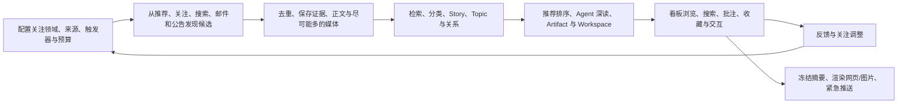

## 6. 端到端用户体验

产品必须允许每个环节独立演进。例如新增 Telegram Connector 不要求修改看板；新增 Board Block 不要求直接读取 Telegram 数据；升级 Story 归并算法不改写原始采集记录。

本阶段的“第一条可用产品 E2E”有独立门槛：预配置来源跑通只能证明 Connector/Worker 管线 smoke，不能证明 Cosmos 对用户可用。产品验收必须从空数据根目录开始，由用户在 Web 选择 `rss` Connector、按 schema 填写实际 RSS URL，完成服务端校验、测试、保存和启用，再由 Worker 抓取该 URL。`fixture-rss`、fixture XML、本地受控 HTTP 源和直接调用 Worker Admin 只计入集成/管线测试。

### 6.1 初步实现与部署约束

以下是当前阶段的技术与运行形态决策，不构成不可替换的领域合同：

- 第一优先级是服务器部署；产品同时为客户端模式，以及客户端与服务分离模式保留兼容边界。
- 三种模式共用版本化的 Service Endpoint、Command、Query、Event 和流式 Transport 合同。客户端通过该合同访问应用能力，不直接访问 Prisma、SQLite、Data Root 或 Blob/Artifact Root。
- Web 使用 React + Next.js App Router；API 使用 NestJS。当前任务 worktree 已用
  独立 Worker、Run/StepRun/Action Job 和固定 Ingest 验证一条 Durable Runtime
  Spike，但该 Spike 尚未合并，也不是目标规范 Kernel；插件加载、用户自定义
  Definition/Action、稳定管理 API 和 Graph 编辑器仍是后续产品能力。
- 开发环境使用 Bun，生产环境使用 Node。共享代码、构建产物和 Worker 运行时保持 Node-compatible，不把 Bun-only API 写入领域层或公共合同。
- 初始持久化使用 Prisma + SQLite；FTS5/BM25、虚拟表、触发器和其它 SQLite 专用能力通过受控 SQL Adapter 使用，以便未来替换存储实现。
- UI 初步使用 Tailwind、shadcn/ui、React Hook Form 和 Zod。shadcn 的组件代码归 Cosmos 源码所有，skill/CLI 只作为开发辅助。
- 服务器交付预留 Docker 镜像与 Compose 运行方式；具体生产编排、认证和公网发布策略后置。
- Desktop Shell 只负责承载 UI、连接本地或远程服务并管理必要的本地生命周期；Tauri、Electron 或其它壳的选择后置，不进入领域模型。
- Phase 1 直接使用 `pi-ai` 满足少量 Agent/LLM 调用。`neuro-agent-harness` 独立演进，稳定后再通过运行时和能力适配合同接入；Harness 的 sidecar 不属于其核心职责。
- Graph、IR 和 Comfy 类可视化表达属于 Workflow 的上层编排格式，可以转换为脚本式 Workflow 语义；不为它们建立第二套执行 Runtime。
- Product Service API、Worker Admin API 和 Worker Gateway 是三个独立边界：
  Product Service 面向 Web/CLI/Desktop，Worker Admin 只负责运维，远程 Worker
  通过 Gateway 主动连接。远程 Worker v1 使用 HTTPS long-poll claim；本地可信
  Worker 仍可直接使用 SQL TaskStore。
- ActionDefinition 声明 `host`、`trusted_worker` 或 `remote_worker` 执行位置。
  领域写入留在 Host；Worker Admin 不提供同步 Job execute 端点；Gateway 不成为
  第二套 Job/lease 真相。
- 工程实施先在独立任务中稳定 `nb-workflow` Kernel API、Memory Backend 和
  conformance；通过门禁后，Cosmos 再以 Task 04 Spike 的持久恢复证据和
  `docs/api/` Draft v0.2 为输入实现本地 Worker/Durable Host。Worker Admin
  随本地 Worker 收敛，远程 Worker Gateway 在此之后单独实施。
